# 泰坦尼克号生存率预测

## 1、提出问题

什么样的人在泰坦尼克号中更容易存活？

## 2、理解数据

### 2.1 采集数据

来源：https://www.kaggle.com/c/titanic/data

### 2.2 导入数据


```python
#导入数据包
import pandas as pd 
import numpy as np
import os 

#结果保存路径
output_path='F:/publicdatasets/output_path'
if not os.path.exists(output_path):
    os.makedirs(output_path)
datafile_path='F:/publicdatasets/titanic'
```


```python
import matplotlib as plt
import seaborn as sns
import warnings
warnings.filterwarnings('ignore')
```


```python
#导入数据
#训练集
train=pd.read_csv(os.path.join(datafile_path,'train.csv'))
#测试集
test=pd.read_csv(os.path.join(datafile_path,'test.csv'))
```


```python
test.head(2)
```


<div>
<style scoped>
    .dataframe tbody tr th:only-of-type {
        vertical-align: middle;
    }

    .dataframe tbody tr th {
        vertical-align: top;
    }

    .dataframe thead th {
        text-align: right;
    }
</style>
<table border="1" class="dataframe">
  <thead>
    <tr style="text-align: right;">
      <th></th>
      <th>PassengerId</th>
      <th>Pclass</th>
      <th>Name</th>
      <th>Sex</th>
      <th>Age</th>
      <th>SibSp</th>
      <th>Parch</th>
      <th>Ticket</th>
      <th>Fare</th>
      <th>Cabin</th>
      <th>Embarked</th>
    </tr>
  </thead>
  <tbody>
    <tr>
      <th>0</th>
      <td>892</td>
      <td>3</td>
      <td>Kelly, Mr. James</td>
      <td>male</td>
      <td>34.5</td>
      <td>0</td>
      <td>0</td>
      <td>330911</td>
      <td>7.8292</td>
      <td>NaN</td>
      <td>Q</td>
    </tr>
    <tr>
      <th>1</th>
      <td>893</td>
      <td>3</td>
      <td>Wilkes, Mrs. James (Ellen Needs)</td>
      <td>female</td>
      <td>47.0</td>
      <td>1</td>
      <td>0</td>
      <td>363272</td>
      <td>7.0000</td>
      <td>NaN</td>
      <td>S</td>
    </tr>
  </tbody>
</table>
</div>


```python
PassengerId=test['PassengerId']
```


```python
PassengerId
```


    0       892
    1       893
    2       894
    3       895
    4       896
           ... 
    413    1305
    414    1306
    415    1307
    416    1308
    417    1309
    Name: PassengerId, Length: 418, dtype: int64


```python
#查看数据情况
display(train.shape)
display(test.shape)
```


    (891, 12)


    (418, 11)


```python
#合并数据集，方便同时对两个数据集进行清洗（这里不是应该分开清洗吗？？）
full=pd.concat([train,test],axis=0)
```


```python
full.shape
```


    (1309, 12)


```python
full.reset_index(inplace=True)
```


```python
full.head().append(full.tail())
```


<div>
<style scoped>
    .dataframe tbody tr th:only-of-type {
        vertical-align: middle;
    }

    .dataframe tbody tr th {
        vertical-align: top;
    }

    .dataframe thead th {
        text-align: right;
    }
</style>
<table border="1" class="dataframe">
  <thead>
    <tr style="text-align: right;">
      <th></th>
      <th>index</th>
      <th>PassengerId</th>
      <th>Survived</th>
      <th>Pclass</th>
      <th>Name</th>
      <th>Sex</th>
      <th>Age</th>
      <th>SibSp</th>
      <th>Parch</th>
      <th>Ticket</th>
      <th>Fare</th>
      <th>Cabin</th>
      <th>Embarked</th>
    </tr>
  </thead>
  <tbody>
    <tr>
      <th>0</th>
      <td>0</td>
      <td>1</td>
      <td>0.0</td>
      <td>3</td>
      <td>Braund, Mr. Owen Harris</td>
      <td>male</td>
      <td>22.0</td>
      <td>1</td>
      <td>0</td>
      <td>A/5 21171</td>
      <td>7.2500</td>
      <td>NaN</td>
      <td>S</td>
    </tr>
    <tr>
      <th>1</th>
      <td>1</td>
      <td>2</td>
      <td>1.0</td>
      <td>1</td>
      <td>Cumings, Mrs. John Bradley (Florence Briggs Th...</td>
      <td>female</td>
      <td>38.0</td>
      <td>1</td>
      <td>0</td>
      <td>PC 17599</td>
      <td>71.2833</td>
      <td>C85</td>
      <td>C</td>
    </tr>
    <tr>
      <th>2</th>
      <td>2</td>
      <td>3</td>
      <td>1.0</td>
      <td>3</td>
      <td>Heikkinen, Miss. Laina</td>
      <td>female</td>
      <td>26.0</td>
      <td>0</td>
      <td>0</td>
      <td>STON/O2. 3101282</td>
      <td>7.9250</td>
      <td>NaN</td>
      <td>S</td>
    </tr>
    <tr>
      <th>3</th>
      <td>3</td>
      <td>4</td>
      <td>1.0</td>
      <td>1</td>
      <td>Futrelle, Mrs. Jacques Heath (Lily May Peel)</td>
      <td>female</td>
      <td>35.0</td>
      <td>1</td>
      <td>0</td>
      <td>113803</td>
      <td>53.1000</td>
      <td>C123</td>
      <td>S</td>
    </tr>
    <tr>
      <th>4</th>
      <td>4</td>
      <td>5</td>
      <td>0.0</td>
      <td>3</td>
      <td>Allen, Mr. William Henry</td>
      <td>male</td>
      <td>35.0</td>
      <td>0</td>
      <td>0</td>
      <td>373450</td>
      <td>8.0500</td>
      <td>NaN</td>
      <td>S</td>
    </tr>
    <tr>
      <th>1304</th>
      <td>413</td>
      <td>1305</td>
      <td>NaN</td>
      <td>3</td>
      <td>Spector, Mr. Woolf</td>
      <td>male</td>
      <td>NaN</td>
      <td>0</td>
      <td>0</td>
      <td>A.5. 3236</td>
      <td>8.0500</td>
      <td>NaN</td>
      <td>S</td>
    </tr>
    <tr>
      <th>1305</th>
      <td>414</td>
      <td>1306</td>
      <td>NaN</td>
      <td>1</td>
      <td>Oliva y Ocana, Dona. Fermina</td>
      <td>female</td>
      <td>39.0</td>
      <td>0</td>
      <td>0</td>
      <td>PC 17758</td>
      <td>108.9000</td>
      <td>C105</td>
      <td>C</td>
    </tr>
    <tr>
      <th>1306</th>
      <td>415</td>
      <td>1307</td>
      <td>NaN</td>
      <td>3</td>
      <td>Saether, Mr. Simon Sivertsen</td>
      <td>male</td>
      <td>38.5</td>
      <td>0</td>
      <td>0</td>
      <td>SOTON/O.Q. 3101262</td>
      <td>7.2500</td>
      <td>NaN</td>
      <td>S</td>
    </tr>
    <tr>
      <th>1307</th>
      <td>416</td>
      <td>1308</td>
      <td>NaN</td>
      <td>3</td>
      <td>Ware, Mr. Frederick</td>
      <td>male</td>
      <td>NaN</td>
      <td>0</td>
      <td>0</td>
      <td>359309</td>
      <td>8.0500</td>
      <td>NaN</td>
      <td>S</td>
    </tr>
    <tr>
      <th>1308</th>
      <td>417</td>
      <td>1309</td>
      <td>NaN</td>
      <td>3</td>
      <td>Peter, Master. Michael J</td>
      <td>male</td>
      <td>NaN</td>
      <td>1</td>
      <td>1</td>
      <td>2668</td>
      <td>22.3583</td>
      <td>NaN</td>
      <td>C</td>
    </tr>
  </tbody>
</table>
</div>


```python
#参考：合并数据集
full_=train.append(test,ignore_index=True)#注意这个append并不会增加新的index
full_.shape
```


    (1309, 12)


```python
full_.head(2)
```


<div>
<style scoped>
    .dataframe tbody tr th:only-of-type {
        vertical-align: middle;
    }

    .dataframe tbody tr th {
        vertical-align: top;
    }

    .dataframe thead th {
        text-align: right;
    }
</style>
<table border="1" class="dataframe">
  <thead>
    <tr style="text-align: right;">
      <th></th>
      <th>PassengerId</th>
      <th>Survived</th>
      <th>Pclass</th>
      <th>Name</th>
      <th>Sex</th>
      <th>Age</th>
      <th>SibSp</th>
      <th>Parch</th>
      <th>Ticket</th>
      <th>Fare</th>
      <th>Cabin</th>
      <th>Embarked</th>
    </tr>
  </thead>
  <tbody>
    <tr>
      <th>0</th>
      <td>1</td>
      <td>0.0</td>
      <td>3</td>
      <td>Braund, Mr. Owen Harris</td>
      <td>male</td>
      <td>22.0</td>
      <td>1</td>
      <td>0</td>
      <td>A/5 21171</td>
      <td>7.2500</td>
      <td>NaN</td>
      <td>S</td>
    </tr>
    <tr>
      <th>1</th>
      <td>2</td>
      <td>1.0</td>
      <td>1</td>
      <td>Cumings, Mrs. John Bradley (Florence Briggs Th...</td>
      <td>female</td>
      <td>38.0</td>
      <td>1</td>
      <td>0</td>
      <td>PC 17599</td>
      <td>71.2833</td>
      <td>C85</td>
      <td>C</td>
    </tr>
  </tbody>
</table>
</div>


```python
#full_=full.drop(['index'],axis=1)
```

### 2.3 查看数据集信息


```python
full_.info()
```

    <class 'pandas.core.frame.DataFrame'>
    RangeIndex: 1309 entries, 0 to 1308
    Data columns (total 12 columns):
     #   Column       Non-Null Count  Dtype  
    ---  ------       --------------  -----  
     0   PassengerId  1309 non-null   int64  
     1   Survived     891 non-null    float64
     2   Pclass       1309 non-null   int64  
     3   Name         1309 non-null   object 
     4   Sex          1309 non-null   object 
     5   Age          1046 non-null   float64
     6   SibSp        1309 non-null   int64  
     7   Parch        1309 non-null   int64  
     8   Ticket       1309 non-null   object 
     9   Fare         1308 non-null   float64
     10  Cabin        295 non-null    object 
     11  Embarked     1307 non-null   object 
    dtypes: float64(3), int64(4), object(5)
    memory usage: 122.8+ KB
    

#提出出不同类型的数据
num_columns=[]

cat_columns=[]


for i in full.columns:

    if full[i].dtype == 'object':

        cat_columns.append(i)

    else:
        num_columns.append(i)

cat_columns

num_columns


```python
#另外一种方法（提取数值类型特征列名）更为方便.
numerical_cols=full_.select_dtypes(exclude='object').columns
print(numerical_cols)
```

    Index(['PassengerId', 'Survived', 'Pclass', 'Age', 'SibSp', 'Parch', 'Fare'], dtype='object')
    


```python
categorical_cols=full_.select_dtypes(include='object').columns
print(categorical_cols)
```

    Index(['Name', 'Sex', 'Ticket', 'Cabin', 'Embarked'], dtype='object')
    


```python
#reindex是指重新索引，把数值变量（7）放在前，分类变量（5）放在后
full_=full_.reindex(columns=['Survived','PassengerId',  'Pclass', 'Age', 'SibSp', 'Parch', 'Fare'
                            ,'Name', 'Sex', 'Ticket', 'Cabin', 'Embarked'])
```


```python
print("显示缺失值，缺失则显示为TRUE：\n", full_.isnull())#是缺失值返回True，否则范围False
print("---------------------------------\n显示每一列中有多少个缺失值：\n",full_.isnull().sum())#返回每列包含的缺失值的个数
```

    显示缺失值，缺失则显示为TRUE：
           Survived  PassengerId  Pclass    Age  SibSp  Parch   Fare   Name    Sex  \
    0        False        False   False  False  False  False  False  False  False   
    1        False        False   False  False  False  False  False  False  False   
    2        False        False   False  False  False  False  False  False  False   
    3        False        False   False  False  False  False  False  False  False   
    4        False        False   False  False  False  False  False  False  False   
    ...        ...          ...     ...    ...    ...    ...    ...    ...    ...   
    1304      True        False   False   True  False  False  False  False  False   
    1305      True        False   False  False  False  False  False  False  False   
    1306      True        False   False  False  False  False  False  False  False   
    1307      True        False   False   True  False  False  False  False  False   
    1308      True        False   False   True  False  False  False  False  False   
    
          Ticket  Cabin  Embarked  
    0      False   True     False  
    1      False  False     False  
    2      False   True     False  
    3      False  False     False  
    4      False   True     False  
    ...      ...    ...       ...  
    1304   False   True     False  
    1305   False  False     False  
    1306   False   True     False  
    1307   False   True     False  
    1308   False   True     False  
    
    [1309 rows x 12 columns]
    ---------------------------------
    显示每一列中有多少个缺失值：
     Survived        418
    PassengerId       0
    Pclass            0
    Age             263
    SibSp             0
    Parch             0
    Fare              1
    Name              0
    Sex               0
    Ticket            0
    Cabin          1014
    Embarked          2
    dtype: int64
    


```python
"""
我们发现数据总共1309行。
其中，
数值型数据中：Survived（418），Age （263），Fare（1）有缺失数据。
类别数据中：Cabin （1014）和Embarked （2）有缺失数据。
"""
```


    '\n我们发现数据总共1309行。\n其中，\n数值型数据中：Survived（418），Age （263），Fare（1）有缺失数据。\n类别数据中：Cabin （1014）和Embarked （2）有缺失数据。\n'


```python
#训练集数据初步分析（使用统计学与绘图）
#目的：初步了解数据之间的相关性，为构造特征工程以及模型建立做准备。
train['Survived'].value_counts()
```


    0    549
    1    342
    Name: Survived, dtype: int64


> 1）Sex Frature：女性幸存率远高于男性


```python
sns.barplot(x='Sex',y="Survived",data=train)
```


    <matplotlib.axes._subplots.AxesSubplot at 0x1ded977ed88>


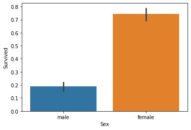


> 2)Pclass Feature:乘客社会等级越高，幸存率越高。


```python
sns.barplot(x='Pclass',y='Survived',data=train)
```


    <matplotlib.axes._subplots.AxesSubplot at 0x1dedaf50348>


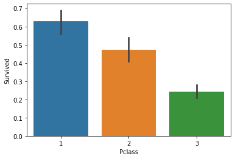


> 3)SibSp Feature:配偶及兄弟姐妹数适中的乘客幸存率更高。


```python
sns.barplot(x='SibSp',y='Survived',data=train)
```


    <matplotlib.axes._subplots.AxesSubplot at 0x1dedafdf1c8>


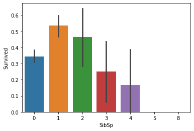


> 4)Parch Feature:父母与子女数适中的乘客幸存率更高。


```python
sns.barplot(x='Parch',y='Survived',data=train)
```


    <matplotlib.axes._subplots.AxesSubplot at 0x1dedb087388>


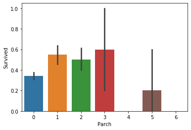


> 5)从不同生还情况的密度图可以看出，再年龄15岁的左侧，生还率有明显差别，密度图非交叉区域面积非常大，但在其他年龄段，
则差别不是很明显，认为是随机所致，因此可以考虑将此年龄偏小的区域分离出来。


```python
facet=sns.FacetGrid(train,hue="Survived",aspect=2)
facet.map(sns.kdeplot,'Age',shade=True)
facet.set(xlim=(0,train['Age'].max()))
facet.add_legend()
plt.pyplot.xlabel('Age')
plt.pyplot.xlabel('density')
#plt.xlabel报错
```


    Text(0.5, 20.800000000000004, 'density')


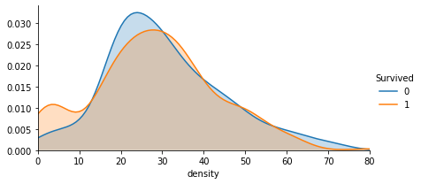


> 6)Emarked 登港港口为C的生存率更高，这个应该保留为模型特征


```python
sns.countplot('Embarked',hue='Survived',data=train)
```


    <matplotlib.axes._subplots.AxesSubplot at 0x1dedb17a6c8>


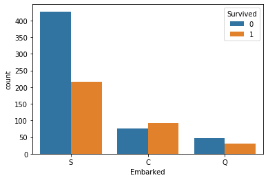


```python
sns.barplot('Embarked','Survived',data=train)
```


    <matplotlib.axes._subplots.AxesSubplot at 0x1dedb213b08>


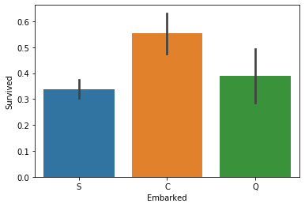


> 7)Title Feature(new):不同Title的乘客幸存率不同


```python
full.shape
```


    (1309, 13)


```python
full['Title']=full['Name'].apply(lambda x:x.split(',')[1].split('.')[0].strip())
```


```python
Title_Dict = {}
Title_Dict.update(dict.fromkeys(['Capt', 'Col', 'Major', 'Dr', 'Rev'], 'Officer'))
Title_Dict.update(dict.fromkeys(['Don', 'Sir', 'the Countess', 'Dona', 'Lady'], 'Royalty'))
Title_Dict.update(dict.fromkeys(['Mme', 'Ms', 'Mrs'], 'Mrs'))
Title_Dict.update(dict.fromkeys(['Mlle', 'Miss'], 'Miss'))
Title_Dict.update(dict.fromkeys(['Mr'], 'Mr'))
Title_Dict.update(dict.fromkeys(['Master','Jonkheer'], 'Master'))
Title_Dict 
```


    {'Capt': 'Officer',
     'Col': 'Officer',
     'Major': 'Officer',
     'Dr': 'Officer',
     'Rev': 'Officer',
     'Don': 'Royalty',
     'Sir': 'Royalty',
     'the Countess': 'Royalty',
     'Dona': 'Royalty',
     'Lady': 'Royalty',
     'Mme': 'Mrs',
     'Ms': 'Mrs',
     'Mrs': 'Mrs',
     'Mlle': 'Miss',
     'Miss': 'Miss',
     'Mr': 'Mr',
     'Master': 'Master',
     'Jonkheer': 'Master'}


```python
full['Title']=full['Title'].map(Title_Dict)
sns.barplot(x='Title',y='Survived',data=full)
```


    <matplotlib.axes._subplots.AxesSubplot at 0x1ded9279c48>


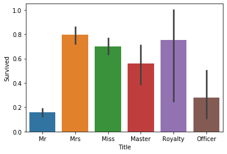


> 8)FamilyLabel Feature(New):家庭人数为2到4的乘客幸存率较高
先计算Familysize=Parch+SibSp+1，然后再分成三类


```python
full['FamilySize']=full['SibSp']+full['Parch']+1
sns.barplot(x="FamilySize", y="Survived", data=full)
```


    <matplotlib.axes._subplots.AxesSubplot at 0x1dedb33ffc8>


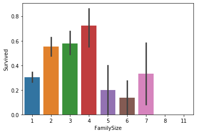


```python
def Fam_label(s):
    if (s >= 2) & (s <= 4):
        return 2
    elif ((s > 4) & (s <= 7)) | (s == 1):
        return 1
    elif (s > 7):
        return 0
full['FamilyLabel']=full['FamilySize'].apply(Fam_label)
sns.barplot(x="FamilyLabel", y="Survived", data=full)
```


    <matplotlib.axes._subplots.AxesSubplot at 0x1dedb402d48>


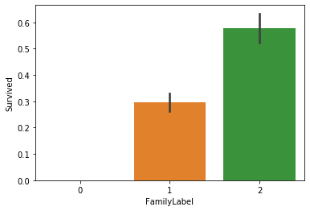


```python
full['Cabin'] = full['Cabin'].fillna('U')
full['Deck']=full['Cabin'].str.get(0)
sns.barplot(x="Deck", y="Survived", data=full)
```


    <matplotlib.axes._subplots.AxesSubplot at 0x1dedb448d48>


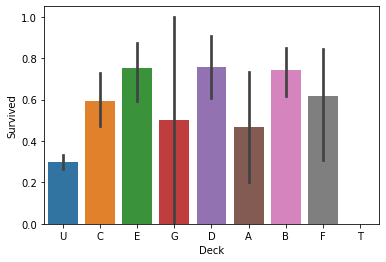


> 10)TicketGroup Feature(New)：与2至4人共票号的乘客幸存率较高
新增TicketGroup特征，统计每个乘客的共票号数。


```python
Ticket_Count = dict(full['Ticket'].value_counts())
full['TicketGroup'] = full['Ticket'].apply(lambda x:Ticket_Count[x])
sns.barplot(x='TicketGroup', y='Survived', data=full)
```


    <matplotlib.axes._subplots.AxesSubplot at 0x1dedb4f8ec8>


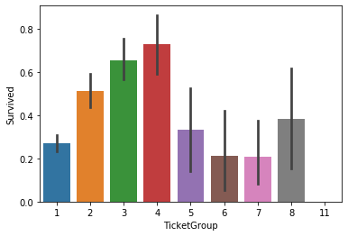


```python
full['TicketGroup'].unique()
```


    array([ 1,  2,  5,  3,  7,  6,  4,  8, 11], dtype=int64)


```python
Ticket_Count
```


    {'CA. 2343': 11,
     '1601': 8,
     'CA 2144': 8,
     '347082': 7,
     '347077': 7,
     'PC 17608': 7,
     '3101295': 7,
     'S.O.C. 14879': 7,
     '19950': 6,
     '382652': 6,
     '113781': 6,
     '347088': 6,
     '16966': 5,
     '113503': 5,
     '4133': 5,
     'PC 17757': 5,
     '220845': 5,
     'W./C. 6608': 5,
     '349909': 5,
     '230136': 4,
     '17421': 4,
     '36928': 4,
     'C.A. 34651': 4,
     '113760': 4,
     '2666': 4,
     'LINE': 4,
     '12749': 4,
     'PC 17755': 4,
     'C.A. 33112': 4,
     'PC 17760': 4,
     'PC 17483': 4,
     'C.A. 2315': 4,
     'W./C. 6607': 4,
     '24160': 4,
     'SC/Paris 2123': 4,
     '35273': 3,
     'C.A. 37671': 3,
     '29106': 3,
     '363291': 3,
     '11767': 3,
     '28220': 3,
     '239853': 3,
     'SOTON/O.Q. 3101315': 3,
     '33638': 3,
     'C.A. 31029': 3,
     'PC 17569': 3,
     '26360': 3,
     'PC 17582': 3,
     '2653': 3,
     'S.C./PARIS 2079': 3,
     '2650': 3,
     '19928': 3,
     '347742': 3,
     '248727': 3,
     '29750': 3,
     'PC 17758': 3,
     '13502': 3,
     '110152': 3,
     '248738': 3,
     '2678': 3,
     '367226': 3,
     '29103': 3,
     'PC 17572': 3,
     'C.A. 2673': 3,
     '2668': 3,
     '347080': 3,
     '315153': 3,
     'C 4001': 3,
     '370129': 3,
     'PP 9549': 3,
     '230080': 3,
     'PC 17756': 3,
     '345773': 3,
     '2662': 3,
     '19877': 3,
     '2661': 3,
     'PC 17558': 3,
     'C.A. 31921': 3,
     '110413': 3,
     'F.C.C. 13529': 3,
     '371110': 3,
     'A/4 48871': 3,
     'A/5. 851': 3,
     'PC 17761': 3,
     'F.C. 12750': 2,
     '11778': 2,
     '349256': 2,
     '113789': 2,
     '2926': 2,
     '250649': 2,
     '113803': 2,
     '237736': 2,
     '226875': 2,
     '376566': 2,
     '364516': 2,
     '11668': 2,
     '2660': 2,
     '392091': 2,
     '2908': 2,
     '250655': 2,
     '244252': 2,
     '17463': 2,
     '244367': 2,
     '349237': 2,
     'PC 17599': 2,
     '2659': 2,
     '376564': 2,
     '347072': 2,
     '113572': 2,
     '110813': 2,
     'PC 17485': 2,
     '250647': 2,
     '24065': 2,
     'STON/O2. 3101279': 2,
     '350026': 2,
     '347054': 2,
     'PC 17611': 2,
     '28664': 2,
     '364498': 2,
     'PC 17597': 2,
     '2699': 2,
     'SC/AH 29037': 2,
     '13236': 2,
     '243847': 2,
     '111361': 2,
     '11751': 2,
     '13050': 2,
     '113505': 2,
     'PC 17603': 2,
     '236853': 2,
     '36973': 2,
     '17464': 2,
     '113776': 2,
     'F.C.C. 13534': 2,
     '113796': 2,
     '345572': 2,
     'A/5. 3337': 2,
     '11765': 2,
     '54636': 2,
     '11967': 2,
     '367230': 2,
     'SC/PARIS 2167': 2,
     '19943': 2,
     '392096': 2,
     '11813': 2,
     '7534': 2,
     '350405': 2,
     '231919': 2,
     '2665': 2,
     '31027': 2,
     'SC/AH 3085': 2,
     '113059': 2,
     '113798': 2,
     '36568': 2,
     '28403': 2,
     '358585': 2,
     '113806': 2,
     'PC 17477': 2,
     '112378': 2,
     'P/PP 3381': 2,
     '349910': 2,
     '11769': 2,
     '386525': 2,
     '345764': 2,
     'C.A. 6212': 2,
     '2627': 2,
     '371362': 2,
     '3101278': 2,
     '13695': 2,
     'S.O./P.P. 2': 2,
     '13507': 2,
     '11753': 2,
     '36947': 2,
     '17453': 2,
     'A/5. 3336': 2,
     'PC 17592': 2,
     '2689': 2,
     'PC 17759': 2,
     '35281': 2,
     '228414': 2,
     '250651': 2,
     '244358': 2,
     'S.O./P.P. 3': 2,
     '112058': 2,
     '113509': 2,
     '239865': 2,
     'CA 31352': 2,
     '2003': 2,
     '2651': 2,
     '2625': 2,
     '250644': 2,
     '113773': 2,
     '364849': 2,
     '110465': 2,
     'F.C.C. 13528': 2,
     '21228': 2,
     '370365': 2,
     'PC 17604': 2,
     'W.E.P. 5734': 2,
     '230433': 2,
     '13567': 2,
     '26707': 2,
     '19996': 2,
     'PC 17593': 2,
     '17474': 2,
     '3101298': 2,
     '370371': 2,
     'PC 17585': 2,
     '13508': 2,
     '345763': 2,
     '2680': 2,
     'C.A. 33595': 2,
     'WE/P 5735': 2,
     '2691': 2,
     '237789': 2,
     '29105': 2,
     '220844': 1,
     'A.5. 3236': 1,
     '349236': 1,
     'SW/PP 751': 1,
     '349253': 1,
     'C.A. 49867': 1,
     '17765': 1,
     '315152': 1,
     '315090': 1,
     'STON/O 2. 3101293': 1,
     '2663': 1,
     '349247': 1,
     '345501': 1,
     '112053': 1,
     '342826': 1,
     '28213': 1,
     '234604': 1,
     '347076': 1,
     '28228': 1,
     '9234': 1,
     '694': 1,
     '2693': 1,
     '2700': 1,
     '237216': 1,
     '17770': 1,
     '382653': 1,
     '349221': 1,
     'PC 17318': 1,
     'SOTON/OQ 3101317': 1,
     '370377': 1,
     '16988': 1,
     '345498': 1,
     '382649': 1,
     '347081': 1,
     'SC/Paris 2163': 1,
     'A/5 2817': 1,
     '349231': 1,
     '2631': 1,
     '363272': 1,
     '348125': 1,
     '370372': 1,
     '244361': 1,
     '349249': 1,
     '7267': 1,
     '2656': 1,
     '1222': 1,
     'C.A. 5547': 1,
     '236171': 1,
     'F.C. 12998': 1,
     '32302': 1,
     '233639': 1,
     '2685': 1,
     '349245': 1,
     '112059': 1,
     '347063': 1,
     '350035': 1,
     '350048': 1,
     '368783': 1,
     'SC/PARIS 2168': 1,
     'A./5. 2152': 1,
     'A/5 1478': 1,
     '2654': 1,
     '7545': 1,
     'SOTON/OQ 392076': 1,
     '347065': 1,
     '349209': 1,
     '31418': 1,
     '113043': 1,
     '345783': 1,
     'STON/OQ. 369943': 1,
     '113786': 1,
     'SO/C 14885': 1,
     '112277': 1,
     '113044': 1,
     '315086': 1,
     '2543': 1,
     '330958': 1,
     '248659': 1,
     'W./C. 14263': 1,
     '248731': 1,
     '2672': 1,
     'PC 17594': 1,
     '250646': 1,
     'PC 17590': 1,
     'STON/O 2. 3101285': 1,
     '349211': 1,
     '392095': 1,
     '347066': 1,
     '367231': 1,
     '3101296': 1,
     'C.A. 30769': 1,
     '349243': 1,
     '7266': 1,
     'A/4. 20589': 1,
     'PC 17607': 1,
     'STON/O2. 3101282': 1,
     '226593': 1,
     '237565': 1,
     '3101276': 1,
     '345770': 1,
     '347067': 1,
     'PC 17476': 1,
     '113055': 1,
     '28034': 1,
     'PC 17612': 1,
     '349207': 1,
     '330959': 1,
     '113787': 1,
     '2671': 1,
     '342684': 1,
     '2664': 1,
     'SOTON/OQ 392089': 1,
     '28666': 1,
     '5727': 1,
     '36209': 1,
     '28425': 1,
     '334915': 1,
     '248706': 1,
     '19952': 1,
     '2676': 1,
     '239856': 1,
     '364506': 1,
     'SOTON/OQ 3101316': 1,
     'SOTON/O.Q. 3101308': 1,
     '350042': 1,
     '341826': 1,
     '343275': 1,
     '345774': 1,
     '347091': 1,
     '17466': 1,
     '368702': 1,
     '14311': 1,
     '3701': 1,
     'C 7075': 1,
     'PC 17609': 1,
     '315091': 1,
     '113791': 1,
     '382650': 1,
     '312993': 1,
     '2647': 1,
     '17465': 1,
     '315083': 1,
     '349238': 1,
     '315095': 1,
     '113794': 1,
     '349911': 1,
     '364511': 1,
     '345780': 1,
     '3101264': 1,
     'STON/O 2. 3101292': 1,
     '111428': 1,
     '362316': 1,
     '237671': 1,
     'PC 17562': 1,
     'C.A. 24580': 1,
     '29107': 1,
     '28221': 1,
     'SOTON/OQ 392082': 1,
     'STON/O 2. 3101280': 1,
     '695': 1,
     '13905': 1,
     '349225': 1,
     'C.A. 34050': 1,
     'A/5 3540': 1,
     '330919': 1,
     '364858': 1,
     '364859': 1,
     '2690': 1,
     '111240': 1,
     '367655': 1,
     '110564': 1,
     '350025': 1,
     '365222': 1,
     '350034': 1,
     '17764': 1,
     '7552': 1,
     '244368': 1,
     '3411': 1,
     '237798': 1,
     '345777': 1,
     'STON/O2. 3101271': 1,
     '367227': 1,
     'SOTON/O.Q. 3101309': 1,
     '349215': 1,
     '345775': 1,
     '4134': 1,
     'C 17369': 1,
     '233866': 1,
     'SC/PARIS 2146': 1,
     '350047': 1,
     '349233': 1,
     '28424': 1,
     '363294': 1,
     'W./C. 6609': 1,
     '7598': 1,
     '367229': 1,
     '113807': 1,
     '112901': 1,
     'AQ/4 3130': 1,
     '342712': 1,
     '28206': 1,
     '347087': 1,
     '211535': 1,
     '233478': 1,
     '2688': 1,
     '248734': 1,
     '113780': 1,
     '368402': 1,
     '113514': 1,
     'PC 17482': 1,
     'A/5 2466': 1,
     '28551': 1,
     '343271': 1,
     '350045': 1,
     'STON/O 2. 3101286': 1,
     '335432': 1,
     'SOTON/O.Q. 3101310': 1,
     '14313': 1,
     '350050': 1,
     'SC/A4 23568': 1,
     'A.5. 11206': 1,
     '350054': 1,
     '65305': 1,
     '113510': 1,
     '330923': 1,
     '11774': 1,
     'A/4 45380': 1,
     '335677': 1,
     '392092': 1,
     '347465': 1,
     '2621': 1,
     '348124': 1,
     '11770': 1,
     '349220': 1,
     '11752': 1,
     '368364': 1,
     '347466': 1,
     '348121': 1,
     '2669': 1,
     '345781': 1,
     'SOTON/O.Q. 3101307': 1,
     '345778': 1,
     '383121': 1,
     'PC 17474': 1,
     'C.A. 17248': 1,
     '350029': 1,
     '113051': 1,
     '349226': 1,
     '312991': 1,
     '368323': 1,
     '347469': 1,
     '4135': 1,
     '349203': 1,
     'SC/PARIS 2166': 1,
     '27267': 1,
     'C.A. 42795': 1,
     '29011': 1,
     '36866': 1,
     '7540': 1,
     'W./C. 14258': 1,
     '113783': 1,
     '2692': 1,
     '113800': 1,
     '7538': 1,
     '235509': 1,
     '237249': 1,
     '111426': 1,
     '248747': 1,
     'SC/PARIS 2131': 1,
     'SC 14888': 1,
     '2623': 1,
     '110469': 1,
     'STON/O2. 3101283': 1,
     '345771': 1,
     '315151': 1,
     '7546': 1,
     '111320': 1,
     '315082': 1,
     '2697': 1,
     '28133': 1,
     '349230': 1,
     '113792': 1,
     '65304': 1,
     'S.C./A.4. 23567': 1,
     '350052': 1,
     '65303': 1,
     '315089': 1,
     'SOTON/O2 3101272': 1,
     '242963': 1,
     '237670': 1,
     '349229': 1,
     '248746': 1,
     '2696': 1,
     '350046': 1,
     '13568': 1,
     '14973': 1,
     '2620': 1,
     '315093': 1,
     '36963': 1,
     '345779': 1,
     '35851': 1,
     'C.A. 24579': 1,
     '349232': 1,
     '12233': 1,
     '239855': 1,
     '350417': 1,
     '347075': 1,
     '2655': 1,
     'SC/PARIS 2147': 1,
     '244270': 1,
     'STON/O 2. 3101269': 1,
     '330931': 1,
     '111427': 1,
     '2648': 1,
     '368573': 1,
     '347078': 1,
     '240929': 1,
     '347464': 1,
     'A. 2. 39186': 1,
     'C.A./SOTON 34068': 1,
     '347070': 1,
     '21332': 1,
     'C.A. 33111': 1,
     '368703': 1,
     '2698': 1,
     'SC/A.3 2861': 1,
     '233734': 1,
     'W/C 14208': 1,
     'PC 17754': 1,
     '236852': 1,
     '364500': 1,
     '229236': 1,
     '372622': 1,
     'A/5 21175': 1,
     '2677': 1,
     '363611': 1,
     '370373': 1,
     'S.P. 3464': 1,
     '112050': 1,
     '19924': 1,
     'A./5. 3338': 1,
     '350036': 1,
     '113056': 1,
     '17475': 1,
     '349251': 1,
     'PC 17580': 1,
     '349242': 1,
     '9232': 1,
     '336439': 1,
     '3101266': 1,
     '349222': 1,
     '220367': 1,
     '349202': 1,
     '11755': 1,
     'AQ/3. 30631': 1,
     '370369': 1,
     '2682': 1,
     '363592': 1,
     '349234': 1,
     '2667': 1,
     '350407': 1,
     '4579': 1,
     '113767': 1,
     'CA. 2314': 1,
     '234360': 1,
     '250648': 1,
     '374887': 1,
     '330911': 1,
     '349210': 1,
     '223596': 1,
     '113784': 1,
     '29108': 1,
     '230434': 1,
     '347090': 1,
     '347071': 1,
     '113054': 1,
     '3101281': 1,
     '113778': 1,
     '330877': 1,
     'C.A. 34260': 1,
     '6563': 1,
     'C.A. 29178': 1,
     'A/4 48873': 1,
     'PC 17591': 1,
     'C.A. 29395': 1,
     '347468': 1,
     '3410': 1,
     '243880': 1,
     '330971': 1,
     'STON/O 2. 3101288': 1,
     '27849': 1,
     'SOTON/O2 3101287': 1,
     '2652': 1,
     'STON/O 2. 3101291': 1,
     '315084': 1,
     '244310': 1,
     '2649': 1,
     'SOTON/O.Q. 3101305': 1,
     '13214': 1,
     '349246': 1,
     '347064': 1,
     '347471': 1,
     '112379': 1,
     'SC 1748': 1,
     '111369': 1,
     '367232': 1,
     '345767': 1,
     'SOTON/O2 3101284': 1,
     '343276': 1,
     '250652': 1,
     '234686': 1,
     '347085': 1,
     'A/5 3536': 1,
     '244373': 1,
     '349218': 1,
     '371109': 1,
     '8471': 1,
     '350033': 1,
     'F.C.C. 13531': 1,
     '349912': 1,
     '113801': 1,
     '4138': 1,
     '21440': 1,
     '347061': 1,
     'F.C.C. 13540': 1,
     '384461': 1,
     '36865': 1,
     '347073': 1,
     'S.O./P.P. 751': 1,
     '350404': 1,
     '2670': 1,
     '693': 1,
     'PC 17531': 1,
     'C.A. 29566': 1,
     '3470': 1,
     '373450': 1,
     '2626': 1,
     '349219': 1,
     '370376': 1,
     '350053': 1,
     '324669': 1,
     '347062': 1,
     'Fa 265302': 1,
     'SC/PARIS 2133': 1,
     'SOTON/OQ 392090': 1,
     '240276': 1,
     'A/5 21173': 1,
     '2687': 1,
     '14312': 1,
     '334912': 1,
     '370374': 1,
     '334914': 1,
     '349223': 1,
     '2684': 1,
     '2683': 1,
     '2657': 1,
     '348123': 1,
     '364512': 1,
     '218629': 1,
     '343120': 1,
     'PC 17605': 1,
     '345768': 1,
     'SOTON/OQ 392083': 1,
     '347083': 1,
     '2624': 1,
     '350403': 1,
     '29104': 1,
     '335097': 1,
     'PC 17601': 1,
     '347470': 1,
     '349214': 1,
     '349212': 1,
     '350406': 1,
     '28404': 1,
     '250643': 1,
     '350043': 1,
     '237668': 1,
     '365237': 1,
     '349252': 1,
     '36864': 1,
     'A/5 3594': 1,
     '382651': 1,
     '27042': 1,
     'A/4. 34244': 1,
     '349248': 1,
     'SOTON/O.Q. 3101314': 1,
     'S.O.P. 1166': 1,
     '364846': 1,
     '28134': 1,
     '112052': 1,
     '234818': 1,
     '350408': 1,
     '342441': 1,
     '31028': 1,
     'SOTON/O.Q. 3101262': 1,
     '2675': 1,
     'PC 17475': 1,
     'PC 17610': 1,
     '3101267': 1,
     'STON/O 2. 3101273': 1,
     'SCO/W 1585': 1,
     '239854': 1,
     '364499': 1,
     '7935': 1,
     'A/S 2816': 1,
     '4136': 1,
     'STON/O 2. 3101268': 1,
     '34218': 1,
     '374746': 1,
     '3101265': 1,
     'S.O./P.P. 752': 1,
     '330963': 1,
     '110489': 1,
     'PC 17595': 1,
     '370375': 1,
     '8475': 1,
     '349244': 1,
     '35852': 1,
     '237734': 1,
     'A/5 21172': 1,
     '113050': 1,
     '315154': 1,
     '19947': 1,
     '4137': 1,
     '347467': 1,
     '370368': 1,
     '250653': 1,
     '11771': 1,
     'C.A. 34644': 1,
     '370370': 1,
     '2673': 1,
     'PC 17613': 1,
     '2629': 1,
     '347069': 1,
     'SOTON/OQ 392086': 1,
     '248740': 1,
     '113788': 1,
     '347060': 1,
     'C.A. 31030': 1,
     '367228': 1,
     '374910': 1,
     '315085': 1,
     '349239': 1,
     'A/5 21174': 1,
     '2681': 1,
     '350409': 1,
     '349206': 1,
     '347743': 1,
     'SOTON/O.Q. 3101306': 1,
     '13509': 1,
     '349235': 1,
     '315098': 1,
     'SOTON/O.Q. 392078': 1,
     '244360': 1,
     '359306': 1,
     '113804': 1,
     'STON/O2. 3101290': 1,
     '330935': 1,
     '211536': 1,
     'SC/PARIS 2159': 1,
     'S.W./PP 752': 1,
     '2674': 1,
     '244346': 1,
     '347089': 1,
     '315037': 1,
     '383123': 1,
     '28665': 1,
     'PC 17600': 1,
     '13049': 1,
     'PC 17473': 1,
     '248698': 1,
     '111163': 1,
     '323951': 1,
     '113038': 1,
     '112377': 1,
     '330909': 1,
     'C 7077': 1,
     '347086': 1,
     'PC 17606': 1,
     '349227': 1,
     'STON/O 2. 3101294': 1,
     '19972': 1,
     '237393': 1,
     '237442': 1,
     'SOTON/O.Q. 3101311': 1,
     '231945': 1,
     '394140': 1,
     '113028': 1,
     'PP 4348': 1,
     '2223': 1,
     '364856': 1,
     'STON/O2. 3101270': 1,
     '36967': 1,
     '349204': 1,
     '347074': 1,
     'A./5. 3235': 1,
     '349255': 1,
     'A/5. 10482': 1,
     '365226': 1,
     '348122': 1,
     '3101277': 1,
     '347079': 1,
     '349224': 1,
     '680': 1,
     '112051': 1,
     '113795': 1,
     '349240': 1,
     'C.A. 18723': 1,
     '315096': 1,
     'PC 17598': 1,
     'SC/PARIS 2148': 1,
     'A4. 54510': 1,
     'C 7076': 1,
     '366713': 1,
     '359309': 1,
     '240261': 1,
     '345765': 1,
     '329944': 1,
     'SC/AH Basle 541': 1,
     '349213': 1,
     '364851': 1,
     '349205': 1,
     'A/4 31416': 1,
     '349208': 1,
     '349228': 1,
     '3101297': 1,
     '330920': 1,
     '239059': 1,
     'C.A. 15185': 1,
     '383162': 1,
     '349254': 1,
     '65306': 1,
     'STON/O 2. 3101275': 1,
     'SOTON/O.Q. 3101312': 1,
     'STON/O 2. 3101289': 1,
     'S.O./P.P. 251': 1,
     '347068': 1,
     '28004': 1,
     '330924': 1,
     '315097': 1,
     'LP 1588': 1,
     '349250': 1,
     '29751': 1,
     '3460': 1,
     'W./C. 14260': 1,
     '113790': 1,
     '364850': 1,
     '2679': 1,
     '349257': 1,
     '2658': 1,
     '349217': 1,
     '13213': 1,
     'W./C. 14266': 1,
     '19988': 1,
     '12460': 1,
     '113501': 1,
     '248733': 1,
     'SOTON/O.Q. 3101263': 1,
     '2686': 1,
     '330932': 1,
     'A.5. 18509': 1,
     'A/4. 39886': 1,
     '250650': 1,
     'A/5. 13032': 1,
     'A/5 21171': 1,
     '330980': 1,
     '2695': 1,
     '7553': 1,
     '349216': 1,
     '315094': 1,
     '248723': 1,
     '2622': 1,
     '350060': 1,
     'C.A. 31026': 1,
     '315087': 1,
     '376563': 1,
     '330968': 1,
     '3474': 1,
     '345364': 1,
     '237735': 1,
     '323592': 1,
     '219533': 1,
     '248744': 1,
     '350416': 1,
     '2628': 1,
     '2694': 1,
     '330972': 1,
     '248726': 1,
     '350410': 1,
     '330910': 1,
     '7548': 1,
     '343095': 1,
     '365235': 1,
     'SC/PARIS 2149': 1,
     '312992': 1,
     '345769': 1,
     '364848': 1,
     '236854': 1,
     '330844': 1,
     'STON/O 2. 3101274': 1,
     'SOTON/O.Q. 392087': 1,
     'C 17368': 1,
     '2641': 1,
     '349201': 1,
     '315092': 1,
     'A/5. 2151': 1,
     '371060': 1,
     'PC 17596': 1,
     '349241': 1,
     'A/5 3902': 1,
     '315088': 1,
     '244278': 1,
     '330979': 1}


> 按生存率把TicketGroup分为三类。


```python
def Ticket_Label(s):
    if (s >= 2) & (s <= 4):
        return 2
    elif ((s > 4) & (s <= 8)) | (s == 1):
        return 1
    elif (s > 8):
        return 0

full['TicketGroup'] = full['TicketGroup'].apply(Ticket_Label)
sns.barplot(x='TicketGroup', y='Survived', data=full)
```


    <matplotlib.axes._subplots.AxesSubplot at 0x1dedb5991c8>


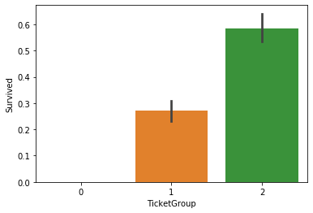


## 3、数据清洗

### 3.1 数据预处理

#### 缺失值处理 

简单的缺失值插补方法：

* data.fillna(data.mean())  #均值插补
* data.fillna(data.median()) #中位数插补
* data.fillna(data.mode())  #众数插补
* data.fillna(data.max())   #最大值插补
* data.fillna(data.min())   #最小值插补
* data.fillna(0)         #固定值插补--用0填充
* data.fillna(5000)       #固定值插补--用已知的行业基本工资填充
* data.fillna（method='ffill'）#最近邻插补--用缺失值的前一个值填充
* data.fillna（method='pad'） #最近邻插补--用缺失值的前一个值填充

常见的做法是(不是很合适)：
* 数值型数据，选用均值取代
* 类别数据，选用最常见的类别取代
* 还可以使用模型预测缺失值，比如，K近邻。


```python
#首先处理数值型数据的缺失值，即：Survived（418），Age （263），Fare（1）
print('处理前：')
full_.info()

#Age
full_['Age']=full_['Age'].fillna(full_['Age'].mean())
#full_['Fare']=full_['Fare'].fillna(full_['Fare'].mean())

print('处理后：')
full_.info()
```

    处理前：
    <class 'pandas.core.frame.DataFrame'>
    RangeIndex: 1309 entries, 0 to 1308
    Data columns (total 12 columns):
     #   Column       Non-Null Count  Dtype  
    ---  ------       --------------  -----  
     0   Survived     891 non-null    float64
     1   PassengerId  1309 non-null   int64  
     2   Pclass       1309 non-null   int64  
     3   Age          1046 non-null   float64
     4   SibSp        1309 non-null   int64  
     5   Parch        1309 non-null   int64  
     6   Fare         1308 non-null   float64
     7   Name         1309 non-null   object 
     8   Sex          1309 non-null   object 
     9   Ticket       1309 non-null   object 
     10  Cabin        295 non-null    object 
     11  Embarked     1307 non-null   object 
    dtypes: float64(3), int64(4), object(5)
    memory usage: 122.8+ KB
    处理后：
    <class 'pandas.core.frame.DataFrame'>
    RangeIndex: 1309 entries, 0 to 1308
    Data columns (total 12 columns):
     #   Column       Non-Null Count  Dtype  
    ---  ------       --------------  -----  
     0   Survived     891 non-null    float64
     1   PassengerId  1309 non-null   int64  
     2   Pclass       1309 non-null   int64  
     3   Age          1309 non-null   float64
     4   SibSp        1309 non-null   int64  
     5   Parch        1309 non-null   int64  
     6   Fare         1308 non-null   float64
     7   Name         1309 non-null   object 
     8   Sex          1309 non-null   object 
     9   Ticket       1309 non-null   object 
     10  Cabin        295 non-null    object 
     11  Embarked     1307 non-null   object 
    dtypes: float64(3), int64(4), object(5)
    memory usage: 122.8+ KB
    

#Fare(Fare缺失量为1，缺失Fare信息的乘客的Embarked为S，Pclass为3，所以用Embarked为S，Pclass为3的乘客的Fare中位数填充。)

#利用多行索引提取出某个单元格的值
full_['Fare']=full_['Fare'].map({None:33.295479})

full_.loc[1043:1043,['Fare']]


```python
full_[full_['Fare'].isnull()]
```


<div>
<style scoped>
    .dataframe tbody tr th:only-of-type {
        vertical-align: middle;
    }

    .dataframe tbody tr th {
        vertical-align: top;
    }

    .dataframe thead th {
        text-align: right;
    }
</style>
<table border="1" class="dataframe">
  <thead>
    <tr style="text-align: right;">
      <th></th>
      <th>Survived</th>
      <th>PassengerId</th>
      <th>Pclass</th>
      <th>Age</th>
      <th>SibSp</th>
      <th>Parch</th>
      <th>Fare</th>
      <th>Name</th>
      <th>Sex</th>
      <th>Ticket</th>
      <th>Cabin</th>
      <th>Embarked</th>
    </tr>
  </thead>
  <tbody>
    <tr>
      <th>1043</th>
      <td>NaN</td>
      <td>1044</td>
      <td>3</td>
      <td>60.5</td>
      <td>0</td>
      <td>0</td>
      <td>NaN</td>
      <td>Storey, Mr. Thomas</td>
      <td>male</td>
      <td>3701</td>
      <td>NaN</td>
      <td>S</td>
    </tr>
  </tbody>
</table>
</div>


```python
#缺失Fare信息的乘客的Embarked为S，Pclass为3，所以用Embarked为S，Pclass为3的乘客的Fare中位数填充。
fare=full_[(full_['Embarked']=='S')&(full['Pclass']==3)].Fare.median()
fare
```


    8.05


```python
full_['Fare']=full_['Fare'].fillna(fare)
```


```python
full_[full_['Fare'].isnull()]
```


<div>
<style scoped>
    .dataframe tbody tr th:only-of-type {
        vertical-align: middle;
    }

    .dataframe tbody tr th {
        vertical-align: top;
    }

    .dataframe thead th {
        text-align: right;
    }
</style>
<table border="1" class="dataframe">
  <thead>
    <tr style="text-align: right;">
      <th></th>
      <th>Survived</th>
      <th>PassengerId</th>
      <th>Pclass</th>
      <th>Age</th>
      <th>SibSp</th>
      <th>Parch</th>
      <th>Fare</th>
      <th>Name</th>
      <th>Sex</th>
      <th>Ticket</th>
      <th>Cabin</th>
      <th>Embarked</th>
    </tr>
  </thead>
  <tbody>
  </tbody>
</table>
</div>


```python
"""
分类变量Embarked，Embarked缺失量为2，缺失Embarked信息的乘客的Pclass均为1，
且Fare均为80，因为Embarked为C且Pclass为1的乘客的Fare中位数为80，所以缺失值填充为C。
"""
full_['Embarked'].value_counts()
```


    S    914
    C    270
    Q    123
    Name: Embarked, dtype: int64


```python
#Embarked缺失量为2
full_[full['Embarked'].isnull()]
```


<div>
<style scoped>
    .dataframe tbody tr th:only-of-type {
        vertical-align: middle;
    }

    .dataframe tbody tr th {
        vertical-align: top;
    }

    .dataframe thead th {
        text-align: right;
    }
</style>
<table border="1" class="dataframe">
  <thead>
    <tr style="text-align: right;">
      <th></th>
      <th>Survived</th>
      <th>PassengerId</th>
      <th>Pclass</th>
      <th>Age</th>
      <th>SibSp</th>
      <th>Parch</th>
      <th>Fare</th>
      <th>Name</th>
      <th>Sex</th>
      <th>Ticket</th>
      <th>Cabin</th>
      <th>Embarked</th>
    </tr>
  </thead>
  <tbody>
    <tr>
      <th>61</th>
      <td>1.0</td>
      <td>62</td>
      <td>1</td>
      <td>38.0</td>
      <td>0</td>
      <td>0</td>
      <td>80.0</td>
      <td>Icard, Miss. Amelie</td>
      <td>female</td>
      <td>113572</td>
      <td>B28</td>
      <td>NaN</td>
    </tr>
    <tr>
      <th>829</th>
      <td>1.0</td>
      <td>830</td>
      <td>1</td>
      <td>62.0</td>
      <td>0</td>
      <td>0</td>
      <td>80.0</td>
      <td>Stone, Mrs. George Nelson (Martha Evelyn)</td>
      <td>female</td>
      <td>113572</td>
      <td>B28</td>
      <td>NaN</td>
    </tr>
  </tbody>
</table>
</div>


```python
#Embarked为C且Pclass为1的乘客的Fare中位数为80，所以缺失值填充为C
full_.groupby(by=['Pclass','Embarked']).Fare.median()
```


    Pclass  Embarked
    1       C           76.7292
            Q           90.0000
            S           52.0000
    2       C           15.3146
            Q           12.3500
            S           15.3750
    3       C            7.8958
            Q            7.7500
            S            8.0500
    Name: Fare, dtype: float64


```python
#从结果来看，S类型最常见，所以我们将缺失值填充为最频繁出现的值
full_['Embarked']=full_['Embarked'].fillna('C')
```


```python
full_['Cabin'].value_counts()
#cabin的缺失值比较多，缺失值填充为U，表示未知Uknow（）
full_['Cabin']=full_['Cabin'].fillna('U')
```


```python
full_.head(3)
```


<div>
<style scoped>
    .dataframe tbody tr th:only-of-type {
        vertical-align: middle;
    }

    .dataframe tbody tr th {
        vertical-align: top;
    }

    .dataframe thead th {
        text-align: right;
    }
</style>
<table border="1" class="dataframe">
  <thead>
    <tr style="text-align: right;">
      <th></th>
      <th>Survived</th>
      <th>PassengerId</th>
      <th>Pclass</th>
      <th>Age</th>
      <th>SibSp</th>
      <th>Parch</th>
      <th>Fare</th>
      <th>Name</th>
      <th>Sex</th>
      <th>Ticket</th>
      <th>Cabin</th>
      <th>Embarked</th>
    </tr>
  </thead>
  <tbody>
    <tr>
      <th>0</th>
      <td>0.0</td>
      <td>1</td>
      <td>3</td>
      <td>22.0</td>
      <td>1</td>
      <td>0</td>
      <td>7.2500</td>
      <td>Braund, Mr. Owen Harris</td>
      <td>male</td>
      <td>A/5 21171</td>
      <td>U</td>
      <td>S</td>
    </tr>
    <tr>
      <th>1</th>
      <td>1.0</td>
      <td>2</td>
      <td>1</td>
      <td>38.0</td>
      <td>1</td>
      <td>0</td>
      <td>71.2833</td>
      <td>Cumings, Mrs. John Bradley (Florence Briggs Th...</td>
      <td>female</td>
      <td>PC 17599</td>
      <td>C85</td>
      <td>C</td>
    </tr>
    <tr>
      <th>2</th>
      <td>1.0</td>
      <td>3</td>
      <td>3</td>
      <td>26.0</td>
      <td>0</td>
      <td>0</td>
      <td>7.9250</td>
      <td>Heikkinen, Miss. Laina</td>
      <td>female</td>
      <td>STON/O2. 3101282</td>
      <td>U</td>
      <td>S</td>
    </tr>
  </tbody>
</table>
</div>


```python
#再次查看缺失值的情况
print(full_.isnull().sum())#返回每列包含的缺失值
#Survived 是最终预测列，不需要进行填充
```

    Survived       418
    PassengerId      0
    Pclass           0
    Age              0
    SibSp            0
    Parch            0
    Fare             0
    Name             0
    Sex              0
    Ticket           0
    Cabin            0
    Embarked         0
    dtype: int64
    

### 3.2 特征提取

查看数据类型，分为3种数据类型（数值型、时间序列、类别数据），并对类别数据处理：用数值表示类别并进行one-hot编码

* 类别数据：'Name', 'Sex', 'Ticket', 'Cabin', 'Embarked'
* 数值型数据：'Survived','PassengerId',  'Pclass', 'Age', 'SibSp', 'Parch', 'Fare'
* 时间序列：无


```python
full_.head()
```


<div>
<style scoped>
    .dataframe tbody tr th:only-of-type {
        vertical-align: middle;
    }

    .dataframe tbody tr th {
        vertical-align: top;
    }

    .dataframe thead th {
        text-align: right;
    }
</style>
<table border="1" class="dataframe">
  <thead>
    <tr style="text-align: right;">
      <th></th>
      <th>Survived</th>
      <th>PassengerId</th>
      <th>Pclass</th>
      <th>Age</th>
      <th>SibSp</th>
      <th>Parch</th>
      <th>Fare</th>
      <th>Name</th>
      <th>Sex</th>
      <th>Ticket</th>
      <th>Cabin</th>
      <th>Embarked</th>
    </tr>
  </thead>
  <tbody>
    <tr>
      <th>0</th>
      <td>0.0</td>
      <td>1</td>
      <td>3</td>
      <td>22.0</td>
      <td>1</td>
      <td>0</td>
      <td>7.2500</td>
      <td>Braund, Mr. Owen Harris</td>
      <td>male</td>
      <td>A/5 21171</td>
      <td>U</td>
      <td>S</td>
    </tr>
    <tr>
      <th>1</th>
      <td>1.0</td>
      <td>2</td>
      <td>1</td>
      <td>38.0</td>
      <td>1</td>
      <td>0</td>
      <td>71.2833</td>
      <td>Cumings, Mrs. John Bradley (Florence Briggs Th...</td>
      <td>female</td>
      <td>PC 17599</td>
      <td>C85</td>
      <td>C</td>
    </tr>
    <tr>
      <th>2</th>
      <td>1.0</td>
      <td>3</td>
      <td>3</td>
      <td>26.0</td>
      <td>0</td>
      <td>0</td>
      <td>7.9250</td>
      <td>Heikkinen, Miss. Laina</td>
      <td>female</td>
      <td>STON/O2. 3101282</td>
      <td>U</td>
      <td>S</td>
    </tr>
    <tr>
      <th>3</th>
      <td>1.0</td>
      <td>4</td>
      <td>1</td>
      <td>35.0</td>
      <td>1</td>
      <td>0</td>
      <td>53.1000</td>
      <td>Futrelle, Mrs. Jacques Heath (Lily May Peel)</td>
      <td>female</td>
      <td>113803</td>
      <td>C123</td>
      <td>S</td>
    </tr>
    <tr>
      <th>4</th>
      <td>0.0</td>
      <td>5</td>
      <td>3</td>
      <td>35.0</td>
      <td>0</td>
      <td>0</td>
      <td>8.0500</td>
      <td>Allen, Mr. William Henry</td>
      <td>male</td>
      <td>373450</td>
      <td>U</td>
      <td>S</td>
    </tr>
  </tbody>
</table>
</div>


```python
#将性别的值映射为数值，male对应值1，famale对应值0。
sex_mapDict={'male':1,'female':0}
#map函数，对Series每个数据应用【自定义】的函数计算
full_['Sex']=full_['Sex'].map(sex_mapDict)
full_.head()
```


<div>
<style scoped>
    .dataframe tbody tr th:only-of-type {
        vertical-align: middle;
    }

    .dataframe tbody tr th {
        vertical-align: top;
    }

    .dataframe thead th {
        text-align: right;
    }
</style>
<table border="1" class="dataframe">
  <thead>
    <tr style="text-align: right;">
      <th></th>
      <th>Survived</th>
      <th>PassengerId</th>
      <th>Pclass</th>
      <th>Age</th>
      <th>SibSp</th>
      <th>Parch</th>
      <th>Fare</th>
      <th>Name</th>
      <th>Sex</th>
      <th>Ticket</th>
      <th>Cabin</th>
      <th>Embarked</th>
    </tr>
  </thead>
  <tbody>
    <tr>
      <th>0</th>
      <td>0.0</td>
      <td>1</td>
      <td>3</td>
      <td>22.0</td>
      <td>1</td>
      <td>0</td>
      <td>7.2500</td>
      <td>Braund, Mr. Owen Harris</td>
      <td>1</td>
      <td>A/5 21171</td>
      <td>U</td>
      <td>S</td>
    </tr>
    <tr>
      <th>1</th>
      <td>1.0</td>
      <td>2</td>
      <td>1</td>
      <td>38.0</td>
      <td>1</td>
      <td>0</td>
      <td>71.2833</td>
      <td>Cumings, Mrs. John Bradley (Florence Briggs Th...</td>
      <td>0</td>
      <td>PC 17599</td>
      <td>C85</td>
      <td>C</td>
    </tr>
    <tr>
      <th>2</th>
      <td>1.0</td>
      <td>3</td>
      <td>3</td>
      <td>26.0</td>
      <td>0</td>
      <td>0</td>
      <td>7.9250</td>
      <td>Heikkinen, Miss. Laina</td>
      <td>0</td>
      <td>STON/O2. 3101282</td>
      <td>U</td>
      <td>S</td>
    </tr>
    <tr>
      <th>3</th>
      <td>1.0</td>
      <td>4</td>
      <td>1</td>
      <td>35.0</td>
      <td>1</td>
      <td>0</td>
      <td>53.1000</td>
      <td>Futrelle, Mrs. Jacques Heath (Lily May Peel)</td>
      <td>0</td>
      <td>113803</td>
      <td>C123</td>
      <td>S</td>
    </tr>
    <tr>
      <th>4</th>
      <td>0.0</td>
      <td>5</td>
      <td>3</td>
      <td>35.0</td>
      <td>0</td>
      <td>0</td>
      <td>8.0500</td>
      <td>Allen, Mr. William Henry</td>
      <td>1</td>
      <td>373450</td>
      <td>U</td>
      <td>S</td>
    </tr>
  </tbody>
</table>
</div>


```python
#创建空的DataFrame存放提取后的特征
embarkeddf=pd.DataFrame()
```


```python
full_['Embarked'].value_counts()
```


    S    914
    C    272
    Q    123
    Name: Embarked, dtype: int64


```python
#使用get_dummies进行one-hot编码，产生虚拟变量/哑变量/dummy variable，列名前缀（prefix）是Embarked
embarkeddf=pd.get_dummies(full_['Embarked'],prefix='Embarked')
embarkeddf.head()
```


<div>
<style scoped>
    .dataframe tbody tr th:only-of-type {
        vertical-align: middle;
    }

    .dataframe tbody tr th {
        vertical-align: top;
    }

    .dataframe thead th {
        text-align: right;
    }
</style>
<table border="1" class="dataframe">
  <thead>
    <tr style="text-align: right;">
      <th></th>
      <th>Embarked_C</th>
      <th>Embarked_Q</th>
      <th>Embarked_S</th>
    </tr>
  </thead>
  <tbody>
    <tr>
      <th>0</th>
      <td>0</td>
      <td>0</td>
      <td>1</td>
    </tr>
    <tr>
      <th>1</th>
      <td>1</td>
      <td>0</td>
      <td>0</td>
    </tr>
    <tr>
      <th>2</th>
      <td>0</td>
      <td>0</td>
      <td>1</td>
    </tr>
    <tr>
      <th>3</th>
      <td>0</td>
      <td>0</td>
      <td>1</td>
    </tr>
    <tr>
      <th>4</th>
      <td>0</td>
      <td>0</td>
      <td>1</td>
    </tr>
  </tbody>
</table>
</div>


```python
#添加one-hot编码产生的虚拟变量到泰坦尼克号数据集full_
full_=pd.concat([full_,embarkeddf],axis=1)#注意：这个concat并没有产生新的index
full_.head()
```


<div>
<style scoped>
    .dataframe tbody tr th:only-of-type {
        vertical-align: middle;
    }

    .dataframe tbody tr th {
        vertical-align: top;
    }

    .dataframe thead th {
        text-align: right;
    }
</style>
<table border="1" class="dataframe">
  <thead>
    <tr style="text-align: right;">
      <th></th>
      <th>Survived</th>
      <th>PassengerId</th>
      <th>Pclass</th>
      <th>Age</th>
      <th>SibSp</th>
      <th>Parch</th>
      <th>Fare</th>
      <th>Name</th>
      <th>Sex</th>
      <th>Ticket</th>
      <th>Cabin</th>
      <th>Embarked</th>
      <th>Embarked_C</th>
      <th>Embarked_Q</th>
      <th>Embarked_S</th>
    </tr>
  </thead>
  <tbody>
    <tr>
      <th>0</th>
      <td>0.0</td>
      <td>1</td>
      <td>3</td>
      <td>22.0</td>
      <td>1</td>
      <td>0</td>
      <td>7.2500</td>
      <td>Braund, Mr. Owen Harris</td>
      <td>1</td>
      <td>A/5 21171</td>
      <td>U</td>
      <td>S</td>
      <td>0</td>
      <td>0</td>
      <td>1</td>
    </tr>
    <tr>
      <th>1</th>
      <td>1.0</td>
      <td>2</td>
      <td>1</td>
      <td>38.0</td>
      <td>1</td>
      <td>0</td>
      <td>71.2833</td>
      <td>Cumings, Mrs. John Bradley (Florence Briggs Th...</td>
      <td>0</td>
      <td>PC 17599</td>
      <td>C85</td>
      <td>C</td>
      <td>1</td>
      <td>0</td>
      <td>0</td>
    </tr>
    <tr>
      <th>2</th>
      <td>1.0</td>
      <td>3</td>
      <td>3</td>
      <td>26.0</td>
      <td>0</td>
      <td>0</td>
      <td>7.9250</td>
      <td>Heikkinen, Miss. Laina</td>
      <td>0</td>
      <td>STON/O2. 3101282</td>
      <td>U</td>
      <td>S</td>
      <td>0</td>
      <td>0</td>
      <td>1</td>
    </tr>
    <tr>
      <th>3</th>
      <td>1.0</td>
      <td>4</td>
      <td>1</td>
      <td>35.0</td>
      <td>1</td>
      <td>0</td>
      <td>53.1000</td>
      <td>Futrelle, Mrs. Jacques Heath (Lily May Peel)</td>
      <td>0</td>
      <td>113803</td>
      <td>C123</td>
      <td>S</td>
      <td>0</td>
      <td>0</td>
      <td>1</td>
    </tr>
    <tr>
      <th>4</th>
      <td>0.0</td>
      <td>5</td>
      <td>3</td>
      <td>35.0</td>
      <td>0</td>
      <td>0</td>
      <td>8.0500</td>
      <td>Allen, Mr. William Henry</td>
      <td>1</td>
      <td>373450</td>
      <td>U</td>
      <td>S</td>
      <td>0</td>
      <td>0</td>
      <td>1</td>
    </tr>
  </tbody>
</table>
</div>


```python
#删掉原‘Embarked’列
full_.drop('Embarked',axis=1,inplace=True)
```


```python
full_.head()
```


<div>
<style scoped>
    .dataframe tbody tr th:only-of-type {
        vertical-align: middle;
    }

    .dataframe tbody tr th {
        vertical-align: top;
    }

    .dataframe thead th {
        text-align: right;
    }
</style>
<table border="1" class="dataframe">
  <thead>
    <tr style="text-align: right;">
      <th></th>
      <th>Survived</th>
      <th>PassengerId</th>
      <th>Pclass</th>
      <th>Age</th>
      <th>SibSp</th>
      <th>Parch</th>
      <th>Fare</th>
      <th>Name</th>
      <th>Sex</th>
      <th>Ticket</th>
      <th>Cabin</th>
      <th>Embarked_C</th>
      <th>Embarked_Q</th>
      <th>Embarked_S</th>
    </tr>
  </thead>
  <tbody>
    <tr>
      <th>0</th>
      <td>0.0</td>
      <td>1</td>
      <td>3</td>
      <td>22.0</td>
      <td>1</td>
      <td>0</td>
      <td>7.2500</td>
      <td>Braund, Mr. Owen Harris</td>
      <td>1</td>
      <td>A/5 21171</td>
      <td>U</td>
      <td>0</td>
      <td>0</td>
      <td>1</td>
    </tr>
    <tr>
      <th>1</th>
      <td>1.0</td>
      <td>2</td>
      <td>1</td>
      <td>38.0</td>
      <td>1</td>
      <td>0</td>
      <td>71.2833</td>
      <td>Cumings, Mrs. John Bradley (Florence Briggs Th...</td>
      <td>0</td>
      <td>PC 17599</td>
      <td>C85</td>
      <td>1</td>
      <td>0</td>
      <td>0</td>
    </tr>
    <tr>
      <th>2</th>
      <td>1.0</td>
      <td>3</td>
      <td>3</td>
      <td>26.0</td>
      <td>0</td>
      <td>0</td>
      <td>7.9250</td>
      <td>Heikkinen, Miss. Laina</td>
      <td>0</td>
      <td>STON/O2. 3101282</td>
      <td>U</td>
      <td>0</td>
      <td>0</td>
      <td>1</td>
    </tr>
    <tr>
      <th>3</th>
      <td>1.0</td>
      <td>4</td>
      <td>1</td>
      <td>35.0</td>
      <td>1</td>
      <td>0</td>
      <td>53.1000</td>
      <td>Futrelle, Mrs. Jacques Heath (Lily May Peel)</td>
      <td>0</td>
      <td>113803</td>
      <td>C123</td>
      <td>0</td>
      <td>0</td>
      <td>1</td>
    </tr>
    <tr>
      <th>4</th>
      <td>0.0</td>
      <td>5</td>
      <td>3</td>
      <td>35.0</td>
      <td>0</td>
      <td>0</td>
      <td>8.0500</td>
      <td>Allen, Mr. William Henry</td>
      <td>1</td>
      <td>373450</td>
      <td>U</td>
      <td>0</td>
      <td>0</td>
      <td>1</td>
    </tr>
  </tbody>
</table>
</div>


```python
#创建存放提取后特征的数据库
pclassdf=pd.DataFrame()
```


```python
full_['Pclass'].value_counts()
```


    3    709
    1    323
    2    277
    Name: Pclass, dtype: int64


```python
#使用get_dummies进行one-hot编码，列名前缀是pclass
pclassdf=pd.get_dummies(full_['Pclass'],prefix='Pclass')
pclassdf.head()
```


<div>
<style scoped>
    .dataframe tbody tr th:only-of-type {
        vertical-align: middle;
    }

    .dataframe tbody tr th {
        vertical-align: top;
    }

    .dataframe thead th {
        text-align: right;
    }
</style>
<table border="1" class="dataframe">
  <thead>
    <tr style="text-align: right;">
      <th></th>
      <th>Pclass_1</th>
      <th>Pclass_2</th>
      <th>Pclass_3</th>
    </tr>
  </thead>
  <tbody>
    <tr>
      <th>0</th>
      <td>0</td>
      <td>0</td>
      <td>1</td>
    </tr>
    <tr>
      <th>1</th>
      <td>1</td>
      <td>0</td>
      <td>0</td>
    </tr>
    <tr>
      <th>2</th>
      <td>0</td>
      <td>0</td>
      <td>1</td>
    </tr>
    <tr>
      <th>3</th>
      <td>1</td>
      <td>0</td>
      <td>0</td>
    </tr>
    <tr>
      <th>4</th>
      <td>0</td>
      <td>0</td>
      <td>1</td>
    </tr>
  </tbody>
</table>
</div>


```python
#添加one-hot编码产生的虚拟变量到泰坦尼克号数据集full_
full_=pd.concat([full_,pclassdf],axis=1)
```


```python
full_.shape
```


    (1309, 17)


```python
full_.info()
```

    <class 'pandas.core.frame.DataFrame'>
    RangeIndex: 1309 entries, 0 to 1308
    Data columns (total 17 columns):
     #   Column       Non-Null Count  Dtype  
    ---  ------       --------------  -----  
     0   Survived     891 non-null    float64
     1   PassengerId  1309 non-null   int64  
     2   Pclass       1309 non-null   int64  
     3   Age          1309 non-null   float64
     4   SibSp        1309 non-null   int64  
     5   Parch        1309 non-null   int64  
     6   Fare         1309 non-null   float64
     7   Name         1309 non-null   object 
     8   Sex          1309 non-null   int64  
     9   Ticket       1309 non-null   object 
     10  Cabin        1309 non-null   object 
     11  Embarked_C   1309 non-null   uint8  
     12  Embarked_Q   1309 non-null   uint8  
     13  Embarked_S   1309 non-null   uint8  
     14  Pclass_1     1309 non-null   uint8  
     15  Pclass_2     1309 non-null   uint8  
     16  Pclass_3     1309 non-null   uint8  
    dtypes: float64(3), int64(5), object(3), uint8(6)
    memory usage: 120.3+ KB
    


```python
#删除原先的'Pclass'列
full_.drop('Pclass',axis=1,inplace=True)
```


```python
full_.shape
```


    (1309, 16)


分类数据中的字符串变量有：Name、Cabin、Ticket  


```python
#从Name中提取头衔
full_['Name'].head()
```


    0                              Braund, Mr. Owen Harris
    1    Cumings, Mrs. John Bradley (Florence Briggs Th...
    2                               Heikkinen, Miss. Laina
    3         Futrelle, Mrs. Jacques Heath (Lily May Peel)
    4                             Allen, Mr. William Henry
    Name: Name, dtype: object


```python
"""
split用于字符串分割，返回一个列表
逗号前面的是名，后面的是“头衔.姓”,比如，Mr；Miss；Mrs
需要定义函数，按逗号分隔，取出头衔
"""
```


    '\nsplit用于字符串分割，返回一个列表\n逗号前面的是名，后面的是“头衔.姓”,比如，Mr；Miss；Mrs\n需要定义函数，按逗号分隔，取出头衔\n'


```python
def getTitle(name):
    str1=name.split(',')[1]
    str2=str1.split('.')[0]
    #strip()方法用于移除字符串头尾指定的字符（默认是空格）
    str3=str2.strip()
    return str3
```


```python
#存放提取后的title
titledf=pd.DataFrame()
```


```python
#map函数，对Series每个数据应用自定义的函数计算
titledf['Title']=full_['Name'].map(getTitle)
titledf.head()
```


<div>
<style scoped>
    .dataframe tbody tr th:only-of-type {
        vertical-align: middle;
    }

    .dataframe tbody tr th {
        vertical-align: top;
    }

    .dataframe thead th {
        text-align: right;
    }
</style>
<table border="1" class="dataframe">
  <thead>
    <tr style="text-align: right;">
      <th></th>
      <th>Title</th>
    </tr>
  </thead>
  <tbody>
    <tr>
      <th>0</th>
      <td>Mr</td>
    </tr>
    <tr>
      <th>1</th>
      <td>Mrs</td>
    </tr>
    <tr>
      <th>2</th>
      <td>Miss</td>
    </tr>
    <tr>
      <th>3</th>
      <td>Mrs</td>
    </tr>
    <tr>
      <th>4</th>
      <td>Mr</td>
    </tr>
  </tbody>
</table>
</div>


```python
titledf['Title'].value_counts()
```


    Mr              757
    Miss            260
    Mrs             197
    Master           61
    Dr                8
    Rev               8
    Col               4
    Major             2
    Ms                2
    Mlle              2
    Capt              1
    Sir               1
    Lady              1
    Don               1
    Mme               1
    Dona              1
    the Countess      1
    Jonkheer          1
    Name: Title, dtype: int64


```python
"""
头衔对应类别如下:
Office、Royaity、Mr、Mrs、Miss、Master

"""
```


    '\n头衔对应类别如下:\nOffice、Royaity、Mr、Mrs、Miss、Master\n\n'


```python
#姓名中头衔与类别的映射关系如下：
title_mapDict={
                     "Capt":       "Officer",
                    "Col":        "Officer",
                    "Major":      "Officer",
                    "Jonkheer":   "Royalty",
                    "Don":        "Royalty",
                    "Sir" :       "Royalty",
                    "Dr":         "Officer",
                    "Rev":        "Officer",
                    "the Countess":"Royalty",
                    "Dona":       "Royalty",
                    "Mme":        "Mrs",
                    "Mlle":       "Miss",
                    "Ms":         "Mrs",
                    "Mr" :        "Mr",
                    "Mrs" :       "Mrs",
                    "Miss" :      "Miss",
                    "Master" :    "Master",
                    "Lady" :      "Royalty"
}
```


```python
#map函数，对Series每个数据应用自定义的函数计算
titledf['Title']=titledf['Title'].map(title_mapDict)
titledf['Title']
```


    0            Mr
    1           Mrs
    2          Miss
    3           Mrs
    4            Mr
             ...   
    1304         Mr
    1305    Royalty
    1306         Mr
    1307         Mr
    1308     Master
    Name: Title, Length: 1309, dtype: object


```python
#使用get_dummies进行one-hot编码
titledf=pd.get_dummies(titledf['Title'],prefix='Title')
titledf.head()

```


<div>
<style scoped>
    .dataframe tbody tr th:only-of-type {
        vertical-align: middle;
    }

    .dataframe tbody tr th {
        vertical-align: top;
    }

    .dataframe thead th {
        text-align: right;
    }
</style>
<table border="1" class="dataframe">
  <thead>
    <tr style="text-align: right;">
      <th></th>
      <th>Title_Master</th>
      <th>Title_Miss</th>
      <th>Title_Mr</th>
      <th>Title_Mrs</th>
      <th>Title_Officer</th>
      <th>Title_Royalty</th>
    </tr>
  </thead>
  <tbody>
    <tr>
      <th>0</th>
      <td>0</td>
      <td>0</td>
      <td>1</td>
      <td>0</td>
      <td>0</td>
      <td>0</td>
    </tr>
    <tr>
      <th>1</th>
      <td>0</td>
      <td>0</td>
      <td>0</td>
      <td>1</td>
      <td>0</td>
      <td>0</td>
    </tr>
    <tr>
      <th>2</th>
      <td>0</td>
      <td>1</td>
      <td>0</td>
      <td>0</td>
      <td>0</td>
      <td>0</td>
    </tr>
    <tr>
      <th>3</th>
      <td>0</td>
      <td>0</td>
      <td>0</td>
      <td>1</td>
      <td>0</td>
      <td>0</td>
    </tr>
    <tr>
      <th>4</th>
      <td>0</td>
      <td>0</td>
      <td>1</td>
      <td>0</td>
      <td>0</td>
      <td>0</td>
    </tr>
  </tbody>
</table>
</div>


```python
#添加one-hot编码产生的虚拟变量到原数据集full_
full_=pd.concat([full_,titledf],axis=1)
```


```python
#删掉Name列
full_.drop('Name',axis=1,inplace=True)
full_.head
```


    <bound method NDFrame.head of       Survived  PassengerId        Age  SibSp  Parch      Fare  Sex  \
    0          0.0            1  22.000000      1      0    7.2500    1   
    1          1.0            2  38.000000      1      0   71.2833    0   
    2          1.0            3  26.000000      0      0    7.9250    0   
    3          1.0            4  35.000000      1      0   53.1000    0   
    4          0.0            5  35.000000      0      0    8.0500    1   
    ...        ...          ...        ...    ...    ...       ...  ...   
    1304       NaN         1305  29.881138      0      0    8.0500    1   
    1305       NaN         1306  39.000000      0      0  108.9000    0   
    1306       NaN         1307  38.500000      0      0    7.2500    1   
    1307       NaN         1308  29.881138      0      0    8.0500    1   
    1308       NaN         1309  29.881138      1      1   22.3583    1   
    
                      Ticket Cabin  Embarked_C  ...  Embarked_S  Pclass_1  \
    0              A/5 21171     U           0  ...           1         0   
    1               PC 17599   C85           1  ...           0         1   
    2       STON/O2. 3101282     U           0  ...           1         0   
    3                 113803  C123           0  ...           1         1   
    4                 373450     U           0  ...           1         0   
    ...                  ...   ...         ...  ...         ...       ...   
    1304           A.5. 3236     U           0  ...           1         0   
    1305            PC 17758  C105           1  ...           0         1   
    1306  SOTON/O.Q. 3101262     U           0  ...           1         0   
    1307              359309     U           0  ...           1         0   
    1308                2668     U           1  ...           0         0   
    
          Pclass_2  Pclass_3  Title_Master  Title_Miss  Title_Mr  Title_Mrs  \
    0            0         1             0           0         1          0   
    1            0         0             0           0         0          1   
    2            0         1             0           1         0          0   
    3            0         0             0           0         0          1   
    4            0         1             0           0         1          0   
    ...        ...       ...           ...         ...       ...        ...   
    1304         0         1             0           0         1          0   
    1305         0         0             0           0         0          0   
    1306         0         1             0           0         1          0   
    1307         0         1             0           0         1          0   
    1308         0         1             1           0         0          0   
    
          Title_Officer  Title_Royalty  
    0                 0              0  
    1                 0              0  
    2                 0              0  
    3                 0              0  
    4                 0              0  
    ...             ...            ...  
    1304              0              0  
    1305              0              1  
    1306              0              0  
    1307              0              0  
    1308              0              0  
    
    [1309 rows x 21 columns]>


```python
full_.shape
```


    (1309, 21)


```python
full_['Cabin'].value_counts()
```


    U                  1014
    C23 C25 C27           6
    B57 B59 B63 B66       5
    G6                    5
    C22 C26               4
                       ... 
    C53                   1
    C111                  1
    C49                   1
    D7                    1
    B82 B84               1
    Name: Cabin, Length: 187, dtype: int64


```python
#创建存放Cabin信息的数据库
cabindf=pd.DataFrame()
```


```python
#Cabin的类别是首字母
full_['Cabin']=full_['Cabin'].map(lambda c:c[0])
#使用get_dummies进行one_hot编码
cabindf=pd.get_dummies(full_['Cabin'],prefix='Cabin')
cabindf.head()
```


<div>
<style scoped>
    .dataframe tbody tr th:only-of-type {
        vertical-align: middle;
    }

    .dataframe tbody tr th {
        vertical-align: top;
    }

    .dataframe thead th {
        text-align: right;
    }
</style>
<table border="1" class="dataframe">
  <thead>
    <tr style="text-align: right;">
      <th></th>
      <th>Cabin_A</th>
      <th>Cabin_B</th>
      <th>Cabin_C</th>
      <th>Cabin_D</th>
      <th>Cabin_E</th>
      <th>Cabin_F</th>
      <th>Cabin_G</th>
      <th>Cabin_T</th>
      <th>Cabin_U</th>
    </tr>
  </thead>
  <tbody>
    <tr>
      <th>0</th>
      <td>0</td>
      <td>0</td>
      <td>0</td>
      <td>0</td>
      <td>0</td>
      <td>0</td>
      <td>0</td>
      <td>0</td>
      <td>1</td>
    </tr>
    <tr>
      <th>1</th>
      <td>0</td>
      <td>0</td>
      <td>1</td>
      <td>0</td>
      <td>0</td>
      <td>0</td>
      <td>0</td>
      <td>0</td>
      <td>0</td>
    </tr>
    <tr>
      <th>2</th>
      <td>0</td>
      <td>0</td>
      <td>0</td>
      <td>0</td>
      <td>0</td>
      <td>0</td>
      <td>0</td>
      <td>0</td>
      <td>1</td>
    </tr>
    <tr>
      <th>3</th>
      <td>0</td>
      <td>0</td>
      <td>1</td>
      <td>0</td>
      <td>0</td>
      <td>0</td>
      <td>0</td>
      <td>0</td>
      <td>0</td>
    </tr>
    <tr>
      <th>4</th>
      <td>0</td>
      <td>0</td>
      <td>0</td>
      <td>0</td>
      <td>0</td>
      <td>0</td>
      <td>0</td>
      <td>0</td>
      <td>1</td>
    </tr>
  </tbody>
</table>
</div>


```python
full_['Cabin']
```


    0       U
    1       C
    2       U
    3       C
    4       U
           ..
    1304    U
    1305    C
    1306    U
    1307    U
    1308    U
    Name: Cabin, Length: 1309, dtype: object


```python
full_=pd.concat([full_,cabindf],axis=1)
full_.drop('Cabin',axis=1,inplace=True)
full_.head(2)
```


<div>
<style scoped>
    .dataframe tbody tr th:only-of-type {
        vertical-align: middle;
    }

    .dataframe tbody tr th {
        vertical-align: top;
    }

    .dataframe thead th {
        text-align: right;
    }
</style>
<table border="1" class="dataframe">
  <thead>
    <tr style="text-align: right;">
      <th></th>
      <th>Survived</th>
      <th>PassengerId</th>
      <th>Age</th>
      <th>SibSp</th>
      <th>Parch</th>
      <th>Fare</th>
      <th>Sex</th>
      <th>Ticket</th>
      <th>Embarked_C</th>
      <th>Embarked_Q</th>
      <th>...</th>
      <th>Title_Royalty</th>
      <th>Cabin_A</th>
      <th>Cabin_B</th>
      <th>Cabin_C</th>
      <th>Cabin_D</th>
      <th>Cabin_E</th>
      <th>Cabin_F</th>
      <th>Cabin_G</th>
      <th>Cabin_T</th>
      <th>Cabin_U</th>
    </tr>
  </thead>
  <tbody>
    <tr>
      <th>0</th>
      <td>0.0</td>
      <td>1</td>
      <td>22.0</td>
      <td>1</td>
      <td>0</td>
      <td>7.2500</td>
      <td>1</td>
      <td>A/5 21171</td>
      <td>0</td>
      <td>0</td>
      <td>...</td>
      <td>0</td>
      <td>0</td>
      <td>0</td>
      <td>0</td>
      <td>0</td>
      <td>0</td>
      <td>0</td>
      <td>0</td>
      <td>0</td>
      <td>1</td>
    </tr>
    <tr>
      <th>1</th>
      <td>1.0</td>
      <td>2</td>
      <td>38.0</td>
      <td>1</td>
      <td>0</td>
      <td>71.2833</td>
      <td>0</td>
      <td>PC 17599</td>
      <td>1</td>
      <td>0</td>
      <td>...</td>
      <td>0</td>
      <td>0</td>
      <td>0</td>
      <td>1</td>
      <td>0</td>
      <td>0</td>
      <td>0</td>
      <td>0</td>
      <td>0</td>
      <td>0</td>
    </tr>
  </tbody>
</table>
<p>2 rows × 29 columns</p>
</div>


建立家庭人数和家庭类别


```python
#建立存放家庭信息数据框
familydf=pd.DataFrame()
#家庭人数=同代直系亲属数（parch）+不同代直系亲属数（SibSp）+乘客自己
familydf['FamilySize']=full['Parch']+full['SibSp']+1
```


```python
"""
家庭类别：
家庭人数=1 ----小家庭；
家庭人数大于2小于等于4--------中等家庭；
家庭人数大于4--------大家庭；
"""
```


    '\n家庭类别：\n家庭人数=1 ----小家庭；\n家庭人数大于2小于等于4--------中等家庭；\n家庭人数大于4--------大家庭；\n'


```python
familydf['Family_Single']=familydf['FamilySize'].map(lambda s:1 if s==1 else 0)
familydf['Family_Small']=familydf['FamilySize'].map(lambda s:1 if 2<=s<=5 else 0)
familydf['Family_Large']=familydf['FamilySize'].map(lambda s:1 if 5<=s else 0)
```


```python
familydf.head(3)
```


<div>
<style scoped>
    .dataframe tbody tr th:only-of-type {
        vertical-align: middle;
    }

    .dataframe tbody tr th {
        vertical-align: top;
    }

    .dataframe thead th {
        text-align: right;
    }
</style>
<table border="1" class="dataframe">
  <thead>
    <tr style="text-align: right;">
      <th></th>
      <th>FamilySize</th>
      <th>Family_Single</th>
      <th>Family_Small</th>
      <th>Family_Large</th>
    </tr>
  </thead>
  <tbody>
    <tr>
      <th>0</th>
      <td>2</td>
      <td>0</td>
      <td>1</td>
      <td>0</td>
    </tr>
    <tr>
      <th>1</th>
      <td>2</td>
      <td>0</td>
      <td>1</td>
      <td>0</td>
    </tr>
    <tr>
      <th>2</th>
      <td>1</td>
      <td>1</td>
      <td>0</td>
      <td>0</td>
    </tr>
  </tbody>
</table>
</div>


```python
full_=pd.concat([full_,familydf],axis=1)
full_.head()
```


<div>
<style scoped>
    .dataframe tbody tr th:only-of-type {
        vertical-align: middle;
    }

    .dataframe tbody tr th {
        vertical-align: top;
    }

    .dataframe thead th {
        text-align: right;
    }
</style>
<table border="1" class="dataframe">
  <thead>
    <tr style="text-align: right;">
      <th></th>
      <th>Survived</th>
      <th>PassengerId</th>
      <th>Age</th>
      <th>SibSp</th>
      <th>Parch</th>
      <th>Fare</th>
      <th>Sex</th>
      <th>Ticket</th>
      <th>Embarked_C</th>
      <th>Embarked_Q</th>
      <th>...</th>
      <th>Cabin_D</th>
      <th>Cabin_E</th>
      <th>Cabin_F</th>
      <th>Cabin_G</th>
      <th>Cabin_T</th>
      <th>Cabin_U</th>
      <th>FamilySize</th>
      <th>Family_Single</th>
      <th>Family_Small</th>
      <th>Family_Large</th>
    </tr>
  </thead>
  <tbody>
    <tr>
      <th>0</th>
      <td>0.0</td>
      <td>1</td>
      <td>22.0</td>
      <td>1</td>
      <td>0</td>
      <td>7.2500</td>
      <td>1</td>
      <td>A/5 21171</td>
      <td>0</td>
      <td>0</td>
      <td>...</td>
      <td>0</td>
      <td>0</td>
      <td>0</td>
      <td>0</td>
      <td>0</td>
      <td>1</td>
      <td>2</td>
      <td>0</td>
      <td>1</td>
      <td>0</td>
    </tr>
    <tr>
      <th>1</th>
      <td>1.0</td>
      <td>2</td>
      <td>38.0</td>
      <td>1</td>
      <td>0</td>
      <td>71.2833</td>
      <td>0</td>
      <td>PC 17599</td>
      <td>1</td>
      <td>0</td>
      <td>...</td>
      <td>0</td>
      <td>0</td>
      <td>0</td>
      <td>0</td>
      <td>0</td>
      <td>0</td>
      <td>2</td>
      <td>0</td>
      <td>1</td>
      <td>0</td>
    </tr>
    <tr>
      <th>2</th>
      <td>1.0</td>
      <td>3</td>
      <td>26.0</td>
      <td>0</td>
      <td>0</td>
      <td>7.9250</td>
      <td>0</td>
      <td>STON/O2. 3101282</td>
      <td>0</td>
      <td>0</td>
      <td>...</td>
      <td>0</td>
      <td>0</td>
      <td>0</td>
      <td>0</td>
      <td>0</td>
      <td>1</td>
      <td>1</td>
      <td>1</td>
      <td>0</td>
      <td>0</td>
    </tr>
    <tr>
      <th>3</th>
      <td>1.0</td>
      <td>4</td>
      <td>35.0</td>
      <td>1</td>
      <td>0</td>
      <td>53.1000</td>
      <td>0</td>
      <td>113803</td>
      <td>0</td>
      <td>0</td>
      <td>...</td>
      <td>0</td>
      <td>0</td>
      <td>0</td>
      <td>0</td>
      <td>0</td>
      <td>0</td>
      <td>2</td>
      <td>0</td>
      <td>1</td>
      <td>0</td>
    </tr>
    <tr>
      <th>4</th>
      <td>0.0</td>
      <td>5</td>
      <td>35.0</td>
      <td>0</td>
      <td>0</td>
      <td>8.0500</td>
      <td>1</td>
      <td>373450</td>
      <td>0</td>
      <td>0</td>
      <td>...</td>
      <td>0</td>
      <td>0</td>
      <td>0</td>
      <td>0</td>
      <td>0</td>
      <td>1</td>
      <td>1</td>
      <td>1</td>
      <td>0</td>
      <td>0</td>
    </tr>
  </tbody>
</table>
<p>5 rows × 33 columns</p>
</div>


### 3.3 特征选择

相关系数法：计算各个特征的相关系数


```python
#相关性矩阵
corrdf=full_.corr()
corrdf
```


<div>
<style scoped>
    .dataframe tbody tr th:only-of-type {
        vertical-align: middle;
    }

    .dataframe tbody tr th {
        vertical-align: top;
    }

    .dataframe thead th {
        text-align: right;
    }
</style>
<table border="1" class="dataframe">
  <thead>
    <tr style="text-align: right;">
      <th></th>
      <th>Survived</th>
      <th>PassengerId</th>
      <th>Age</th>
      <th>SibSp</th>
      <th>Parch</th>
      <th>Fare</th>
      <th>Sex</th>
      <th>Embarked_C</th>
      <th>Embarked_Q</th>
      <th>Embarked_S</th>
      <th>...</th>
      <th>Cabin_D</th>
      <th>Cabin_E</th>
      <th>Cabin_F</th>
      <th>Cabin_G</th>
      <th>Cabin_T</th>
      <th>Cabin_U</th>
      <th>FamilySize</th>
      <th>Family_Single</th>
      <th>Family_Small</th>
      <th>Family_Large</th>
    </tr>
  </thead>
  <tbody>
    <tr>
      <th>Survived</th>
      <td>1.000000</td>
      <td>-0.005007</td>
      <td>-0.070323</td>
      <td>-0.035322</td>
      <td>0.081629</td>
      <td>0.257307</td>
      <td>-0.543351</td>
      <td>0.174718</td>
      <td>0.003650</td>
      <td>-0.155660</td>
      <td>...</td>
      <td>0.150716</td>
      <td>0.145321</td>
      <td>0.057935</td>
      <td>0.016040</td>
      <td>-0.026456</td>
      <td>-0.316912</td>
      <td>0.016639</td>
      <td>-0.203367</td>
      <td>0.263023</td>
      <td>-0.125147</td>
    </tr>
    <tr>
      <th>PassengerId</th>
      <td>-0.005007</td>
      <td>1.000000</td>
      <td>0.025731</td>
      <td>-0.055224</td>
      <td>0.008942</td>
      <td>0.031029</td>
      <td>0.013406</td>
      <td>0.045887</td>
      <td>0.011585</td>
      <td>-0.047923</td>
      <td>...</td>
      <td>0.000549</td>
      <td>-0.008136</td>
      <td>0.000306</td>
      <td>-0.045949</td>
      <td>-0.023049</td>
      <td>0.000208</td>
      <td>-0.031437</td>
      <td>0.028546</td>
      <td>-0.002720</td>
      <td>-0.063415</td>
    </tr>
    <tr>
      <th>Age</th>
      <td>-0.070323</td>
      <td>0.025731</td>
      <td>1.000000</td>
      <td>-0.190747</td>
      <td>-0.130872</td>
      <td>0.170619</td>
      <td>0.057397</td>
      <td>0.081855</td>
      <td>-0.012718</td>
      <td>-0.064267</td>
      <td>...</td>
      <td>0.132886</td>
      <td>0.106600</td>
      <td>-0.072644</td>
      <td>-0.085977</td>
      <td>0.032461</td>
      <td>-0.271918</td>
      <td>-0.196996</td>
      <td>0.116675</td>
      <td>-0.050668</td>
      <td>-0.161210</td>
    </tr>
    <tr>
      <th>SibSp</th>
      <td>-0.035322</td>
      <td>-0.055224</td>
      <td>-0.190747</td>
      <td>1.000000</td>
      <td>0.373587</td>
      <td>0.160388</td>
      <td>-0.109609</td>
      <td>-0.050068</td>
      <td>-0.048678</td>
      <td>0.075198</td>
      <td>...</td>
      <td>-0.015727</td>
      <td>-0.027180</td>
      <td>-0.008619</td>
      <td>0.006015</td>
      <td>-0.013247</td>
      <td>0.009064</td>
      <td>0.861952</td>
      <td>-0.591077</td>
      <td>0.301397</td>
      <td>0.699681</td>
    </tr>
    <tr>
      <th>Parch</th>
      <td>0.081629</td>
      <td>0.008942</td>
      <td>-0.130872</td>
      <td>0.373587</td>
      <td>1.000000</td>
      <td>0.221668</td>
      <td>-0.213125</td>
      <td>-0.010287</td>
      <td>-0.100943</td>
      <td>0.073258</td>
      <td>...</td>
      <td>-0.027385</td>
      <td>0.001084</td>
      <td>0.020481</td>
      <td>0.058325</td>
      <td>-0.012304</td>
      <td>-0.036806</td>
      <td>0.792296</td>
      <td>-0.549022</td>
      <td>0.311363</td>
      <td>0.624627</td>
    </tr>
    <tr>
      <th>Fare</th>
      <td>0.257307</td>
      <td>0.031029</td>
      <td>0.170619</td>
      <td>0.160388</td>
      <td>0.221668</td>
      <td>1.000000</td>
      <td>-0.185744</td>
      <td>0.289027</td>
      <td>-0.129922</td>
      <td>-0.172884</td>
      <td>...</td>
      <td>0.072801</td>
      <td>0.074009</td>
      <td>-0.037516</td>
      <td>-0.022831</td>
      <td>0.001189</td>
      <td>-0.507352</td>
      <td>0.226653</td>
      <td>-0.275103</td>
      <td>0.227076</td>
      <td>0.170934</td>
    </tr>
    <tr>
      <th>Sex</th>
      <td>-0.543351</td>
      <td>0.013406</td>
      <td>0.057397</td>
      <td>-0.109609</td>
      <td>-0.213125</td>
      <td>-0.185744</td>
      <td>1.000000</td>
      <td>-0.071447</td>
      <td>-0.088651</td>
      <td>0.119504</td>
      <td>...</td>
      <td>-0.057396</td>
      <td>-0.040340</td>
      <td>-0.006655</td>
      <td>-0.083285</td>
      <td>0.020558</td>
      <td>0.137396</td>
      <td>-0.188583</td>
      <td>0.284537</td>
      <td>-0.272831</td>
      <td>-0.077748</td>
    </tr>
    <tr>
      <th>Embarked_C</th>
      <td>0.174718</td>
      <td>0.045887</td>
      <td>0.081855</td>
      <td>-0.050068</td>
      <td>-0.010287</td>
      <td>0.289027</td>
      <td>-0.071447</td>
      <td>1.000000</td>
      <td>-0.164932</td>
      <td>-0.779058</td>
      <td>...</td>
      <td>0.106770</td>
      <td>0.026814</td>
      <td>-0.020436</td>
      <td>-0.031713</td>
      <td>-0.014161</td>
      <td>-0.264535</td>
      <td>-0.038556</td>
      <td>-0.104528</td>
      <td>0.156351</td>
      <td>-0.093546</td>
    </tr>
    <tr>
      <th>Embarked_Q</th>
      <td>0.003650</td>
      <td>0.011585</td>
      <td>-0.012718</td>
      <td>-0.048678</td>
      <td>-0.100943</td>
      <td>-0.129922</td>
      <td>-0.088651</td>
      <td>-0.164932</td>
      <td>1.000000</td>
      <td>-0.489874</td>
      <td>...</td>
      <td>-0.061459</td>
      <td>-0.042877</td>
      <td>-0.020282</td>
      <td>-0.019941</td>
      <td>-0.008904</td>
      <td>0.142369</td>
      <td>-0.087190</td>
      <td>0.127214</td>
      <td>-0.132399</td>
      <td>-0.018423</td>
    </tr>
    <tr>
      <th>Embarked_S</th>
      <td>-0.155660</td>
      <td>-0.047923</td>
      <td>-0.064267</td>
      <td>0.075198</td>
      <td>0.073258</td>
      <td>-0.172884</td>
      <td>0.119504</td>
      <td>-0.779058</td>
      <td>-0.489874</td>
      <td>1.000000</td>
      <td>...</td>
      <td>-0.055307</td>
      <td>0.003555</td>
      <td>0.030956</td>
      <td>0.040707</td>
      <td>0.018177</td>
      <td>0.143324</td>
      <td>0.089503</td>
      <td>0.011527</td>
      <td>-0.054038</td>
      <td>0.094396</td>
    </tr>
    <tr>
      <th>Pclass_1</th>
      <td>0.285904</td>
      <td>0.026495</td>
      <td>0.362587</td>
      <td>-0.034256</td>
      <td>-0.013033</td>
      <td>0.600115</td>
      <td>-0.107371</td>
      <td>0.331414</td>
      <td>-0.166101</td>
      <td>-0.187353</td>
      <td>...</td>
      <td>0.275698</td>
      <td>0.242963</td>
      <td>-0.073083</td>
      <td>-0.035441</td>
      <td>0.048310</td>
      <td>-0.776987</td>
      <td>-0.029656</td>
      <td>-0.126551</td>
      <td>0.162430</td>
      <td>-0.067523</td>
    </tr>
    <tr>
      <th>Pclass_2</th>
      <td>0.093349</td>
      <td>0.022714</td>
      <td>-0.014193</td>
      <td>-0.052419</td>
      <td>-0.010057</td>
      <td>-0.121168</td>
      <td>-0.028862</td>
      <td>-0.136260</td>
      <td>-0.121973</td>
      <td>0.197973</td>
      <td>...</td>
      <td>-0.037929</td>
      <td>-0.050210</td>
      <td>0.127371</td>
      <td>-0.032081</td>
      <td>-0.014325</td>
      <td>0.176485</td>
      <td>-0.039976</td>
      <td>-0.035075</td>
      <td>0.081803</td>
      <td>-0.118495</td>
    </tr>
    <tr>
      <th>Pclass_3</th>
      <td>-0.322308</td>
      <td>-0.041544</td>
      <td>-0.302093</td>
      <td>0.072610</td>
      <td>0.019521</td>
      <td>-0.419921</td>
      <td>0.116562</td>
      <td>-0.175057</td>
      <td>0.243706</td>
      <td>-0.000181</td>
      <td>...</td>
      <td>-0.207455</td>
      <td>-0.169063</td>
      <td>-0.041178</td>
      <td>0.056964</td>
      <td>-0.030057</td>
      <td>0.527614</td>
      <td>0.058430</td>
      <td>0.138250</td>
      <td>-0.207600</td>
      <td>0.155560</td>
    </tr>
    <tr>
      <th>Title_Master</th>
      <td>0.085221</td>
      <td>0.002254</td>
      <td>-0.363923</td>
      <td>0.329171</td>
      <td>0.253482</td>
      <td>0.011677</td>
      <td>0.164375</td>
      <td>-0.014966</td>
      <td>-0.009091</td>
      <td>0.019007</td>
      <td>...</td>
      <td>-0.042192</td>
      <td>0.001860</td>
      <td>0.058311</td>
      <td>-0.013690</td>
      <td>-0.006113</td>
      <td>0.041178</td>
      <td>0.355061</td>
      <td>-0.265355</td>
      <td>0.141354</td>
      <td>0.301809</td>
    </tr>
    <tr>
      <th>Title_Miss</th>
      <td>0.332795</td>
      <td>-0.050027</td>
      <td>-0.254146</td>
      <td>0.077564</td>
      <td>0.066473</td>
      <td>0.092229</td>
      <td>-0.672819</td>
      <td>-0.011490</td>
      <td>0.198804</td>
      <td>-0.116216</td>
      <td>...</td>
      <td>-0.012516</td>
      <td>0.008700</td>
      <td>-0.003088</td>
      <td>0.061881</td>
      <td>-0.013832</td>
      <td>-0.004364</td>
      <td>0.087350</td>
      <td>-0.023890</td>
      <td>0.000520</td>
      <td>0.083422</td>
    </tr>
    <tr>
      <th>Title_Mr</th>
      <td>-0.549199</td>
      <td>0.014116</td>
      <td>0.165476</td>
      <td>-0.243104</td>
      <td>-0.304780</td>
      <td>-0.192493</td>
      <td>0.870678</td>
      <td>-0.069770</td>
      <td>-0.080224</td>
      <td>0.112665</td>
      <td>...</td>
      <td>-0.030261</td>
      <td>-0.032953</td>
      <td>-0.026403</td>
      <td>-0.072514</td>
      <td>0.023611</td>
      <td>0.131807</td>
      <td>-0.326487</td>
      <td>0.386262</td>
      <td>-0.325627</td>
      <td>-0.194207</td>
    </tr>
    <tr>
      <th>Title_Mrs</th>
      <td>0.344935</td>
      <td>0.033299</td>
      <td>0.198091</td>
      <td>0.061643</td>
      <td>0.213491</td>
      <td>0.139381</td>
      <td>-0.571176</td>
      <td>0.101746</td>
      <td>-0.100374</td>
      <td>-0.026129</td>
      <td>...</td>
      <td>0.080393</td>
      <td>0.045538</td>
      <td>0.013376</td>
      <td>0.042547</td>
      <td>-0.011742</td>
      <td>-0.162253</td>
      <td>0.157233</td>
      <td>-0.354649</td>
      <td>0.364308</td>
      <td>0.012893</td>
    </tr>
    <tr>
      <th>Title_Officer</th>
      <td>-0.031316</td>
      <td>0.002231</td>
      <td>0.162818</td>
      <td>-0.013813</td>
      <td>-0.032631</td>
      <td>0.028743</td>
      <td>0.087288</td>
      <td>0.003164</td>
      <td>-0.003212</td>
      <td>-0.000755</td>
      <td>...</td>
      <td>0.006055</td>
      <td>-0.024048</td>
      <td>-0.017076</td>
      <td>-0.008281</td>
      <td>-0.003698</td>
      <td>-0.067030</td>
      <td>-0.026921</td>
      <td>0.013303</td>
      <td>-0.000791</td>
      <td>-0.034572</td>
    </tr>
    <tr>
      <th>Title_Royalty</th>
      <td>0.033391</td>
      <td>0.004400</td>
      <td>0.059466</td>
      <td>-0.010787</td>
      <td>-0.030197</td>
      <td>0.026237</td>
      <td>-0.020408</td>
      <td>0.076747</td>
      <td>-0.021853</td>
      <td>-0.053946</td>
      <td>...</td>
      <td>-0.012950</td>
      <td>-0.012202</td>
      <td>-0.008665</td>
      <td>-0.004202</td>
      <td>-0.001876</td>
      <td>-0.071672</td>
      <td>-0.023600</td>
      <td>0.008761</td>
      <td>-0.002462</td>
      <td>-0.017542</td>
    </tr>
    <tr>
      <th>Cabin_A</th>
      <td>0.022287</td>
      <td>-0.002831</td>
      <td>0.125177</td>
      <td>-0.039808</td>
      <td>-0.030707</td>
      <td>0.020141</td>
      <td>0.047561</td>
      <td>0.094163</td>
      <td>-0.042105</td>
      <td>-0.056466</td>
      <td>...</td>
      <td>-0.024952</td>
      <td>-0.023510</td>
      <td>-0.016695</td>
      <td>-0.008096</td>
      <td>-0.003615</td>
      <td>-0.242399</td>
      <td>-0.042967</td>
      <td>0.045227</td>
      <td>-0.033805</td>
      <td>-0.033799</td>
    </tr>
    <tr>
      <th>Cabin_B</th>
      <td>0.175095</td>
      <td>0.015895</td>
      <td>0.113458</td>
      <td>-0.011569</td>
      <td>0.073051</td>
      <td>0.393792</td>
      <td>-0.094453</td>
      <td>0.177630</td>
      <td>-0.073613</td>
      <td>-0.110214</td>
      <td>...</td>
      <td>-0.043624</td>
      <td>-0.041103</td>
      <td>-0.029188</td>
      <td>-0.014154</td>
      <td>-0.006320</td>
      <td>-0.423794</td>
      <td>0.032318</td>
      <td>-0.087912</td>
      <td>0.112079</td>
      <td>0.013470</td>
    </tr>
    <tr>
      <th>Cabin_C</th>
      <td>0.114652</td>
      <td>0.006092</td>
      <td>0.167993</td>
      <td>0.048616</td>
      <td>0.009601</td>
      <td>0.401437</td>
      <td>-0.077473</td>
      <td>0.156565</td>
      <td>-0.059151</td>
      <td>-0.100788</td>
      <td>...</td>
      <td>-0.053083</td>
      <td>-0.050016</td>
      <td>-0.035516</td>
      <td>-0.017224</td>
      <td>-0.007691</td>
      <td>-0.515684</td>
      <td>0.037226</td>
      <td>-0.137498</td>
      <td>0.130466</td>
      <td>0.001362</td>
    </tr>
    <tr>
      <th>Cabin_D</th>
      <td>0.150716</td>
      <td>0.000549</td>
      <td>0.132886</td>
      <td>-0.015727</td>
      <td>-0.027385</td>
      <td>0.072801</td>
      <td>-0.057396</td>
      <td>0.106770</td>
      <td>-0.061459</td>
      <td>-0.055307</td>
      <td>...</td>
      <td>1.000000</td>
      <td>-0.034317</td>
      <td>-0.024369</td>
      <td>-0.011817</td>
      <td>-0.005277</td>
      <td>-0.353822</td>
      <td>-0.025313</td>
      <td>-0.074310</td>
      <td>0.094510</td>
      <td>-0.049336</td>
    </tr>
    <tr>
      <th>Cabin_E</th>
      <td>0.145321</td>
      <td>-0.008136</td>
      <td>0.106600</td>
      <td>-0.027180</td>
      <td>0.001084</td>
      <td>0.074009</td>
      <td>-0.040340</td>
      <td>0.026814</td>
      <td>-0.042877</td>
      <td>0.003555</td>
      <td>...</td>
      <td>-0.034317</td>
      <td>1.000000</td>
      <td>-0.022961</td>
      <td>-0.011135</td>
      <td>-0.004972</td>
      <td>-0.333381</td>
      <td>-0.017285</td>
      <td>-0.042535</td>
      <td>0.060877</td>
      <td>-0.046485</td>
    </tr>
    <tr>
      <th>Cabin_F</th>
      <td>0.057935</td>
      <td>0.000306</td>
      <td>-0.072644</td>
      <td>-0.008619</td>
      <td>0.020481</td>
      <td>-0.037516</td>
      <td>-0.006655</td>
      <td>-0.020436</td>
      <td>-0.020282</td>
      <td>0.030956</td>
      <td>...</td>
      <td>-0.024369</td>
      <td>-0.022961</td>
      <td>1.000000</td>
      <td>-0.007907</td>
      <td>-0.003531</td>
      <td>-0.236733</td>
      <td>0.005525</td>
      <td>0.004055</td>
      <td>0.008109</td>
      <td>-0.033009</td>
    </tr>
    <tr>
      <th>Cabin_G</th>
      <td>0.016040</td>
      <td>-0.045949</td>
      <td>-0.085977</td>
      <td>0.006015</td>
      <td>0.058325</td>
      <td>-0.022831</td>
      <td>-0.083285</td>
      <td>-0.031713</td>
      <td>-0.019941</td>
      <td>0.040707</td>
      <td>...</td>
      <td>-0.011817</td>
      <td>-0.011135</td>
      <td>-0.007907</td>
      <td>1.000000</td>
      <td>-0.001712</td>
      <td>-0.114803</td>
      <td>0.035835</td>
      <td>-0.076397</td>
      <td>0.084265</td>
      <td>-0.016008</td>
    </tr>
    <tr>
      <th>Cabin_T</th>
      <td>-0.026456</td>
      <td>-0.023049</td>
      <td>0.032461</td>
      <td>-0.013247</td>
      <td>-0.012304</td>
      <td>0.001189</td>
      <td>0.020558</td>
      <td>-0.014161</td>
      <td>-0.008904</td>
      <td>0.018177</td>
      <td>...</td>
      <td>-0.005277</td>
      <td>-0.004972</td>
      <td>-0.003531</td>
      <td>-0.001712</td>
      <td>1.000000</td>
      <td>-0.051263</td>
      <td>-0.015438</td>
      <td>0.022411</td>
      <td>-0.020319</td>
      <td>-0.007148</td>
    </tr>
    <tr>
      <th>Cabin_U</th>
      <td>-0.316912</td>
      <td>0.000208</td>
      <td>-0.271918</td>
      <td>0.009064</td>
      <td>-0.036806</td>
      <td>-0.507352</td>
      <td>0.137396</td>
      <td>-0.264535</td>
      <td>0.142369</td>
      <td>0.143324</td>
      <td>...</td>
      <td>-0.353822</td>
      <td>-0.333381</td>
      <td>-0.236733</td>
      <td>-0.114803</td>
      <td>-0.051263</td>
      <td>1.000000</td>
      <td>-0.014155</td>
      <td>0.175812</td>
      <td>-0.209053</td>
      <td>0.056438</td>
    </tr>
    <tr>
      <th>FamilySize</th>
      <td>0.016639</td>
      <td>-0.031437</td>
      <td>-0.196996</td>
      <td>0.861952</td>
      <td>0.792296</td>
      <td>0.226653</td>
      <td>-0.188583</td>
      <td>-0.038556</td>
      <td>-0.087190</td>
      <td>0.089503</td>
      <td>...</td>
      <td>-0.025313</td>
      <td>-0.017285</td>
      <td>0.005525</td>
      <td>0.035835</td>
      <td>-0.015438</td>
      <td>-0.014155</td>
      <td>1.000000</td>
      <td>-0.688864</td>
      <td>0.368427</td>
      <td>0.801623</td>
    </tr>
    <tr>
      <th>Family_Single</th>
      <td>-0.203367</td>
      <td>0.028546</td>
      <td>0.116675</td>
      <td>-0.591077</td>
      <td>-0.549022</td>
      <td>-0.275103</td>
      <td>0.284537</td>
      <td>-0.104528</td>
      <td>0.127214</td>
      <td>0.011527</td>
      <td>...</td>
      <td>-0.074310</td>
      <td>-0.042535</td>
      <td>0.004055</td>
      <td>-0.076397</td>
      <td>0.022411</td>
      <td>0.175812</td>
      <td>-0.688864</td>
      <td>1.000000</td>
      <td>-0.906623</td>
      <td>-0.318944</td>
    </tr>
    <tr>
      <th>Family_Small</th>
      <td>0.263023</td>
      <td>-0.002720</td>
      <td>-0.050668</td>
      <td>0.301397</td>
      <td>0.311363</td>
      <td>0.227076</td>
      <td>-0.272831</td>
      <td>0.156351</td>
      <td>-0.132399</td>
      <td>-0.054038</td>
      <td>...</td>
      <td>0.094510</td>
      <td>0.060877</td>
      <td>0.008109</td>
      <td>0.084265</td>
      <td>-0.020319</td>
      <td>-0.209053</td>
      <td>0.368427</td>
      <td>-0.906623</td>
      <td>1.000000</td>
      <td>-0.044618</td>
    </tr>
    <tr>
      <th>Family_Large</th>
      <td>-0.125147</td>
      <td>-0.063415</td>
      <td>-0.161210</td>
      <td>0.699681</td>
      <td>0.624627</td>
      <td>0.170934</td>
      <td>-0.077748</td>
      <td>-0.093546</td>
      <td>-0.018423</td>
      <td>0.094396</td>
      <td>...</td>
      <td>-0.049336</td>
      <td>-0.046485</td>
      <td>-0.033009</td>
      <td>-0.016008</td>
      <td>-0.007148</td>
      <td>0.056438</td>
      <td>0.801623</td>
      <td>-0.318944</td>
      <td>-0.044618</td>
      <td>1.000000</td>
    </tr>
  </tbody>
</table>
<p>32 rows × 32 columns</p>
</div>


```python
#查看各个特征与被预测变量（Survived）的相关系数
corrdf['Survived'].sort_values(ascending=False)
```


    Survived         1.000000
    Title_Mrs        0.344935
    Title_Miss       0.332795
    Pclass_1         0.285904
    Family_Small     0.263023
    Fare             0.257307
    Cabin_B          0.175095
    Embarked_C       0.174718
    Cabin_D          0.150716
    Cabin_E          0.145321
    Cabin_C          0.114652
    Pclass_2         0.093349
    Title_Master     0.085221
    Parch            0.081629
    Cabin_F          0.057935
    Title_Royalty    0.033391
    Cabin_A          0.022287
    FamilySize       0.016639
    Cabin_G          0.016040
    Embarked_Q       0.003650
    PassengerId     -0.005007
    Cabin_T         -0.026456
    Title_Officer   -0.031316
    SibSp           -0.035322
    Age             -0.070323
    Family_Large    -0.125147
    Embarked_S      -0.155660
    Family_Single   -0.203367
    Cabin_U         -0.316912
    Pclass_3        -0.322308
    Sex             -0.543351
    Title_Mr        -0.549199
    Name: Survived, dtype: float64


```python
#跟进各个特征与生存情况的相关系数大小，选择如下几个特征作为模型的输入：
full_X = pd.concat([titledf,
                    pclassdf,
                    familydf,
                    full['Fare'],
                    cabindf,
                    embarkeddf,
                    full_['Sex']
                   ],axis = 1)
full_X.head()
```


<div>
<style scoped>
    .dataframe tbody tr th:only-of-type {
        vertical-align: middle;
    }

    .dataframe tbody tr th {
        vertical-align: top;
    }

    .dataframe thead th {
        text-align: right;
    }
</style>
<table border="1" class="dataframe">
  <thead>
    <tr style="text-align: right;">
      <th></th>
      <th>Title_Master</th>
      <th>Title_Miss</th>
      <th>Title_Mr</th>
      <th>Title_Mrs</th>
      <th>Title_Officer</th>
      <th>Title_Royalty</th>
      <th>Pclass_1</th>
      <th>Pclass_2</th>
      <th>Pclass_3</th>
      <th>FamilySize</th>
      <th>...</th>
      <th>Cabin_D</th>
      <th>Cabin_E</th>
      <th>Cabin_F</th>
      <th>Cabin_G</th>
      <th>Cabin_T</th>
      <th>Cabin_U</th>
      <th>Embarked_C</th>
      <th>Embarked_Q</th>
      <th>Embarked_S</th>
      <th>Sex</th>
    </tr>
  </thead>
  <tbody>
    <tr>
      <th>0</th>
      <td>0</td>
      <td>0</td>
      <td>1</td>
      <td>0</td>
      <td>0</td>
      <td>0</td>
      <td>0</td>
      <td>0</td>
      <td>1</td>
      <td>2</td>
      <td>...</td>
      <td>0</td>
      <td>0</td>
      <td>0</td>
      <td>0</td>
      <td>0</td>
      <td>1</td>
      <td>0</td>
      <td>0</td>
      <td>1</td>
      <td>1</td>
    </tr>
    <tr>
      <th>1</th>
      <td>0</td>
      <td>0</td>
      <td>0</td>
      <td>1</td>
      <td>0</td>
      <td>0</td>
      <td>1</td>
      <td>0</td>
      <td>0</td>
      <td>2</td>
      <td>...</td>
      <td>0</td>
      <td>0</td>
      <td>0</td>
      <td>0</td>
      <td>0</td>
      <td>0</td>
      <td>1</td>
      <td>0</td>
      <td>0</td>
      <td>0</td>
    </tr>
    <tr>
      <th>2</th>
      <td>0</td>
      <td>1</td>
      <td>0</td>
      <td>0</td>
      <td>0</td>
      <td>0</td>
      <td>0</td>
      <td>0</td>
      <td>1</td>
      <td>1</td>
      <td>...</td>
      <td>0</td>
      <td>0</td>
      <td>0</td>
      <td>0</td>
      <td>0</td>
      <td>1</td>
      <td>0</td>
      <td>0</td>
      <td>1</td>
      <td>0</td>
    </tr>
    <tr>
      <th>3</th>
      <td>0</td>
      <td>0</td>
      <td>0</td>
      <td>1</td>
      <td>0</td>
      <td>0</td>
      <td>1</td>
      <td>0</td>
      <td>0</td>
      <td>2</td>
      <td>...</td>
      <td>0</td>
      <td>0</td>
      <td>0</td>
      <td>0</td>
      <td>0</td>
      <td>0</td>
      <td>0</td>
      <td>0</td>
      <td>1</td>
      <td>0</td>
    </tr>
    <tr>
      <th>4</th>
      <td>0</td>
      <td>0</td>
      <td>1</td>
      <td>0</td>
      <td>0</td>
      <td>0</td>
      <td>0</td>
      <td>0</td>
      <td>1</td>
      <td>1</td>
      <td>...</td>
      <td>0</td>
      <td>0</td>
      <td>0</td>
      <td>0</td>
      <td>0</td>
      <td>1</td>
      <td>0</td>
      <td>0</td>
      <td>1</td>
      <td>1</td>
    </tr>
  </tbody>
</table>
<p>5 rows × 27 columns</p>
</div>


```python
full_X.shape
```


    (1309, 27)


## 4、构建模型

用训练集和某个机器学习算法得到机器学习模型，用测试数据评估模型


```python
"""
kaggle中titantic包含三份数据：
gender_submission.csv;test..csv;train.csv
"""
```


    '\nkaggle中titantic包含三份数据：\ngender_submission.csv;test..csv;train.csv\n'


```python
gender_submission=pd.read_csv(os.path.join(datafile_path,'gender_submission.csv'))
gender_submission.shape
```


    (418, 2)


```python
gender_submission.head(3)#只有被预测列Survived
```


<div>
<style scoped>
    .dataframe tbody tr th:only-of-type {
        vertical-align: middle;
    }

    .dataframe tbody tr th {
        vertical-align: top;
    }

    .dataframe thead th {
        text-align: right;
    }
</style>
<table border="1" class="dataframe">
  <thead>
    <tr style="text-align: right;">
      <th></th>
      <th>PassengerId</th>
      <th>Survived</th>
    </tr>
  </thead>
  <tbody>
    <tr>
      <th>0</th>
      <td>892</td>
      <td>0</td>
    </tr>
    <tr>
      <th>1</th>
      <td>893</td>
      <td>1</td>
    </tr>
    <tr>
      <th>2</th>
      <td>894</td>
      <td>0</td>
    </tr>
  </tbody>
</table>
</div>


```python
train_=pd.read_csv(os.path.join(datafile_path,'train.csv'))
train_.shape
```


    (891, 12)


```python
train_.head()
```


<div>
<style scoped>
    .dataframe tbody tr th:only-of-type {
        vertical-align: middle;
    }

    .dataframe tbody tr th {
        vertical-align: top;
    }

    .dataframe thead th {
        text-align: right;
    }
</style>
<table border="1" class="dataframe">
  <thead>
    <tr style="text-align: right;">
      <th></th>
      <th>PassengerId</th>
      <th>Survived</th>
      <th>Pclass</th>
      <th>Name</th>
      <th>Sex</th>
      <th>Age</th>
      <th>SibSp</th>
      <th>Parch</th>
      <th>Ticket</th>
      <th>Fare</th>
      <th>Cabin</th>
      <th>Embarked</th>
    </tr>
  </thead>
  <tbody>
    <tr>
      <th>0</th>
      <td>1</td>
      <td>0</td>
      <td>3</td>
      <td>Braund, Mr. Owen Harris</td>
      <td>male</td>
      <td>22.0</td>
      <td>1</td>
      <td>0</td>
      <td>A/5 21171</td>
      <td>7.2500</td>
      <td>NaN</td>
      <td>S</td>
    </tr>
    <tr>
      <th>1</th>
      <td>2</td>
      <td>1</td>
      <td>1</td>
      <td>Cumings, Mrs. John Bradley (Florence Briggs Th...</td>
      <td>female</td>
      <td>38.0</td>
      <td>1</td>
      <td>0</td>
      <td>PC 17599</td>
      <td>71.2833</td>
      <td>C85</td>
      <td>C</td>
    </tr>
    <tr>
      <th>2</th>
      <td>3</td>
      <td>1</td>
      <td>3</td>
      <td>Heikkinen, Miss. Laina</td>
      <td>female</td>
      <td>26.0</td>
      <td>0</td>
      <td>0</td>
      <td>STON/O2. 3101282</td>
      <td>7.9250</td>
      <td>NaN</td>
      <td>S</td>
    </tr>
    <tr>
      <th>3</th>
      <td>4</td>
      <td>1</td>
      <td>1</td>
      <td>Futrelle, Mrs. Jacques Heath (Lily May Peel)</td>
      <td>female</td>
      <td>35.0</td>
      <td>1</td>
      <td>0</td>
      <td>113803</td>
      <td>53.1000</td>
      <td>C123</td>
      <td>S</td>
    </tr>
    <tr>
      <th>4</th>
      <td>5</td>
      <td>0</td>
      <td>3</td>
      <td>Allen, Mr. William Henry</td>
      <td>male</td>
      <td>35.0</td>
      <td>0</td>
      <td>0</td>
      <td>373450</td>
      <td>8.0500</td>
      <td>NaN</td>
      <td>S</td>
    </tr>
  </tbody>
</table>
</div>


```python
test_=pd.read_csv(os.path.join(datafile_path,'test.csv'))
test_.head()#没有被预测列Survived
```


<div>
<style scoped>
    .dataframe tbody tr th:only-of-type {
        vertical-align: middle;
    }

    .dataframe tbody tr th {
        vertical-align: top;
    }

    .dataframe thead th {
        text-align: right;
    }
</style>
<table border="1" class="dataframe">
  <thead>
    <tr style="text-align: right;">
      <th></th>
      <th>PassengerId</th>
      <th>Pclass</th>
      <th>Name</th>
      <th>Sex</th>
      <th>Age</th>
      <th>SibSp</th>
      <th>Parch</th>
      <th>Ticket</th>
      <th>Fare</th>
      <th>Cabin</th>
      <th>Embarked</th>
    </tr>
  </thead>
  <tbody>
    <tr>
      <th>0</th>
      <td>892</td>
      <td>3</td>
      <td>Kelly, Mr. James</td>
      <td>male</td>
      <td>34.5</td>
      <td>0</td>
      <td>0</td>
      <td>330911</td>
      <td>7.8292</td>
      <td>NaN</td>
      <td>Q</td>
    </tr>
    <tr>
      <th>1</th>
      <td>893</td>
      <td>3</td>
      <td>Wilkes, Mrs. James (Ellen Needs)</td>
      <td>female</td>
      <td>47.0</td>
      <td>1</td>
      <td>0</td>
      <td>363272</td>
      <td>7.0000</td>
      <td>NaN</td>
      <td>S</td>
    </tr>
    <tr>
      <th>2</th>
      <td>894</td>
      <td>2</td>
      <td>Myles, Mr. Thomas Francis</td>
      <td>male</td>
      <td>62.0</td>
      <td>0</td>
      <td>0</td>
      <td>240276</td>
      <td>9.6875</td>
      <td>NaN</td>
      <td>Q</td>
    </tr>
    <tr>
      <th>3</th>
      <td>895</td>
      <td>3</td>
      <td>Wirz, Mr. Albert</td>
      <td>male</td>
      <td>27.0</td>
      <td>0</td>
      <td>0</td>
      <td>315154</td>
      <td>8.6625</td>
      <td>NaN</td>
      <td>S</td>
    </tr>
    <tr>
      <th>4</th>
      <td>896</td>
      <td>3</td>
      <td>Hirvonen, Mrs. Alexander (Helga E Lindqvist)</td>
      <td>female</td>
      <td>22.0</td>
      <td>1</td>
      <td>1</td>
      <td>3101298</td>
      <td>12.2875</td>
      <td>NaN</td>
      <td>S</td>
    </tr>
  </tbody>
</table>
</div>


```python
"""
所以，我们使用train作为我们的原始数据集，从这个数据集中拆分出训练数据集合测试数据集。
train的shape是(891, 12),即可以定义sorcerow=891， 从特征集合full_X提取原始数据集前891行数据，而由于行号是从
0开始的，所以我们要减去1，因为行号是从0开始的。

"""

```


    '\n所以，我们使用train作为我们的原始数据集，从这个数据集中拆分出训练数据集合测试数据集。\ntrain的shape是(891, 12),即可以定义sorcerow=891， 从特征集合full_X提取原始数据集前891行数据，而由于行号是从\n0开始的，所以我们要减去1，因为行号是从0开始的。\n\n'


```python
sourcerow=891
#原始数据集：特征
source_x=full_X.loc[0:sourcerow-1,:]
```


```python
source_x.info()
```

    <class 'pandas.core.frame.DataFrame'>
    RangeIndex: 891 entries, 0 to 890
    Data columns (total 27 columns):
     #   Column         Non-Null Count  Dtype  
    ---  ------         --------------  -----  
     0   Title_Master   891 non-null    uint8  
     1   Title_Miss     891 non-null    uint8  
     2   Title_Mr       891 non-null    uint8  
     3   Title_Mrs      891 non-null    uint8  
     4   Title_Officer  891 non-null    uint8  
     5   Title_Royalty  891 non-null    uint8  
     6   Pclass_1       891 non-null    uint8  
     7   Pclass_2       891 non-null    uint8  
     8   Pclass_3       891 non-null    uint8  
     9   FamilySize     891 non-null    int64  
     10  Family_Single  891 non-null    int64  
     11  Family_Small   891 non-null    int64  
     12  Family_Large   891 non-null    int64  
     13  Fare           891 non-null    float64
     14  Cabin_A        891 non-null    uint8  
     15  Cabin_B        891 non-null    uint8  
     16  Cabin_C        891 non-null    uint8  
     17  Cabin_D        891 non-null    uint8  
     18  Cabin_E        891 non-null    uint8  
     19  Cabin_F        891 non-null    uint8  
     20  Cabin_G        891 non-null    uint8  
     21  Cabin_T        891 non-null    uint8  
     22  Cabin_U        891 non-null    uint8  
     23  Embarked_C     891 non-null    uint8  
     24  Embarked_Q     891 non-null    uint8  
     25  Embarked_S     891 non-null    uint8  
     26  Sex            891 non-null    int64  
    dtypes: float64(1), int64(5), uint8(21)
    memory usage: 60.2 KB
    


```python
source_x.shape
```


    (891, 27)


```python
#原始数据集：标签
source_y=full_.loc[0:sourcerow-1,'Survived']

```


```python
#预测数据集：特征
pred_x=full_X.loc[sourcerow:,:]
```


```python
pred_y=full_.loc[sourcerow:,'Survived']
```


```python
pred_y.shape
```


    (418,)


```python
#将原始数据集拆分成训练集和测试集
from sklearn.model_selection import train_test_split

x_train,x_test,y_train,y_test=train_test_split(source_x,source_y,train_size=0.8,random_state=120)
```


```python
x_train.reset_index(inplace=True)
```


```python
x_train.reset_index(inplace=True)

```


```python
print(source_x.shape)
print(x_train.shape)
print(x_test.shape)

print(source_y.shape)
print(y_train.shape)
print(y_test.shape)
```

    (891, 27)
    (712, 29)
    (179, 27)
    (891,)
    (712,)
    (179,)
    


```python
x_train.info()
```

    <class 'pandas.core.frame.DataFrame'>
    RangeIndex: 712 entries, 0 to 711
    Data columns (total 29 columns):
     #   Column         Non-Null Count  Dtype  
    ---  ------         --------------  -----  
     0   level_0        712 non-null    int64  
     1   index          712 non-null    int64  
     2   Title_Master   712 non-null    uint8  
     3   Title_Miss     712 non-null    uint8  
     4   Title_Mr       712 non-null    uint8  
     5   Title_Mrs      712 non-null    uint8  
     6   Title_Officer  712 non-null    uint8  
     7   Title_Royalty  712 non-null    uint8  
     8   Pclass_1       712 non-null    uint8  
     9   Pclass_2       712 non-null    uint8  
     10  Pclass_3       712 non-null    uint8  
     11  FamilySize     712 non-null    int64  
     12  Family_Single  712 non-null    int64  
     13  Family_Small   712 non-null    int64  
     14  Family_Large   712 non-null    int64  
     15  Fare           712 non-null    float64
     16  Cabin_A        712 non-null    uint8  
     17  Cabin_B        712 non-null    uint8  
     18  Cabin_C        712 non-null    uint8  
     19  Cabin_D        712 non-null    uint8  
     20  Cabin_E        712 non-null    uint8  
     21  Cabin_F        712 non-null    uint8  
     22  Cabin_G        712 non-null    uint8  
     23  Cabin_T        712 non-null    uint8  
     24  Cabin_U        712 non-null    uint8  
     25  Embarked_C     712 non-null    uint8  
     26  Embarked_Q     712 non-null    uint8  
     27  Embarked_S     712 non-null    uint8  
     28  Sex            712 non-null    int64  
    dtypes: float64(1), int64(7), uint8(21)
    memory usage: 59.2 KB
    


```python
x_train.head(2)
```


<div>
<style scoped>
    .dataframe tbody tr th:only-of-type {
        vertical-align: middle;
    }

    .dataframe tbody tr th {
        vertical-align: top;
    }

    .dataframe thead th {
        text-align: right;
    }
</style>
<table border="1" class="dataframe">
  <thead>
    <tr style="text-align: right;">
      <th></th>
      <th>Title_Master</th>
      <th>Title_Miss</th>
      <th>Title_Mr</th>
      <th>Title_Mrs</th>
      <th>Title_Officer</th>
      <th>Title_Royalty</th>
      <th>Pclass_1</th>
      <th>Pclass_2</th>
      <th>Pclass_3</th>
      <th>FamilySize</th>
      <th>...</th>
      <th>Cabin_D</th>
      <th>Cabin_E</th>
      <th>Cabin_F</th>
      <th>Cabin_G</th>
      <th>Cabin_T</th>
      <th>Cabin_U</th>
      <th>Embarked_C</th>
      <th>Embarked_Q</th>
      <th>Embarked_S</th>
      <th>Sex</th>
    </tr>
  </thead>
  <tbody>
    <tr>
      <th>0</th>
      <td>0</td>
      <td>1</td>
      <td>0</td>
      <td>0</td>
      <td>0</td>
      <td>0</td>
      <td>0</td>
      <td>0</td>
      <td>1</td>
      <td>11</td>
      <td>...</td>
      <td>0</td>
      <td>0</td>
      <td>0</td>
      <td>0</td>
      <td>0</td>
      <td>1</td>
      <td>0</td>
      <td>0</td>
      <td>1</td>
      <td>0</td>
    </tr>
    <tr>
      <th>1</th>
      <td>0</td>
      <td>1</td>
      <td>0</td>
      <td>0</td>
      <td>0</td>
      <td>0</td>
      <td>0</td>
      <td>0</td>
      <td>1</td>
      <td>1</td>
      <td>...</td>
      <td>0</td>
      <td>0</td>
      <td>0</td>
      <td>0</td>
      <td>0</td>
      <td>1</td>
      <td>0</td>
      <td>1</td>
      <td>0</td>
      <td>0</td>
    </tr>
  </tbody>
</table>
<p>2 rows × 27 columns</p>
</div>


```python
x_train.drop(['level_0','index'],inplace=True,axis=1)
```


```python
x_train.head(2)
```


<div>
<style scoped>
    .dataframe tbody tr th:only-of-type {
        vertical-align: middle;
    }

    .dataframe tbody tr th {
        vertical-align: top;
    }

    .dataframe thead th {
        text-align: right;
    }
</style>
<table border="1" class="dataframe">
  <thead>
    <tr style="text-align: right;">
      <th></th>
      <th>Title_Master</th>
      <th>Title_Miss</th>
      <th>Title_Mr</th>
      <th>Title_Mrs</th>
      <th>Title_Officer</th>
      <th>Title_Royalty</th>
      <th>Pclass_1</th>
      <th>Pclass_2</th>
      <th>Pclass_3</th>
      <th>FamilySize</th>
      <th>...</th>
      <th>Cabin_D</th>
      <th>Cabin_E</th>
      <th>Cabin_F</th>
      <th>Cabin_G</th>
      <th>Cabin_T</th>
      <th>Cabin_U</th>
      <th>Embarked_C</th>
      <th>Embarked_Q</th>
      <th>Embarked_S</th>
      <th>Sex</th>
    </tr>
  </thead>
  <tbody>
    <tr>
      <th>0</th>
      <td>0</td>
      <td>1</td>
      <td>0</td>
      <td>0</td>
      <td>0</td>
      <td>0</td>
      <td>0</td>
      <td>0</td>
      <td>1</td>
      <td>11</td>
      <td>...</td>
      <td>0</td>
      <td>0</td>
      <td>0</td>
      <td>0</td>
      <td>0</td>
      <td>1</td>
      <td>0</td>
      <td>0</td>
      <td>1</td>
      <td>0</td>
    </tr>
    <tr>
      <th>1</th>
      <td>0</td>
      <td>1</td>
      <td>0</td>
      <td>0</td>
      <td>0</td>
      <td>0</td>
      <td>0</td>
      <td>0</td>
      <td>1</td>
      <td>1</td>
      <td>...</td>
      <td>0</td>
      <td>0</td>
      <td>0</td>
      <td>0</td>
      <td>0</td>
      <td>1</td>
      <td>0</td>
      <td>1</td>
      <td>0</td>
      <td>0</td>
    </tr>
  </tbody>
</table>
<p>2 rows × 27 columns</p>
</div>


### 4.2 选择机器学习算法


```python
from sklearn.linear_model import LogisticRegression
model=LogisticRegression(random_state=123)
model.fit(x_train,y_train)
```


    LogisticRegression(C=1.0, class_weight=None, dual=False, fit_intercept=True,
                       intercept_scaling=1, l1_ratio=None, max_iter=100,
                       multi_class='auto', n_jobs=None, penalty='l2',
                       random_state=123, solver='lbfgs', tol=0.0001, verbose=0,
                       warm_start=False)


## 5、评估模型


```python
model.score(x_test,y_test)
```


    0.8044692737430168


```python
x_test.shape
```


    (179, 27)


```python
predictions = model.predict(pred_x)
```


```python
predictions.shape
```


    (418,)


```python
# 输出预测并保存为本地文件
output = pd.DataFrame({"PassengerId": PassengerId,'Survived': predictions})
```


```python
output.shape
```


    (418, 2)


```python
output.head()
```


<div>
<style scoped>
    .dataframe tbody tr th:only-of-type {
        vertical-align: middle;
    }

    .dataframe tbody tr th {
        vertical-align: top;
    }

    .dataframe thead th {
        text-align: right;
    }
</style>
<table border="1" class="dataframe">
  <thead>
    <tr style="text-align: right;">
      <th></th>
      <th>PassengerId</th>
      <th>Survived</th>
    </tr>
  </thead>
  <tbody>
    <tr>
      <th>0</th>
      <td>892</td>
      <td>0.0</td>
    </tr>
    <tr>
      <th>1</th>
      <td>893</td>
      <td>1.0</td>
    </tr>
    <tr>
      <th>2</th>
      <td>894</td>
      <td>0.0</td>
    </tr>
    <tr>
      <th>3</th>
      <td>895</td>
      <td>0.0</td>
    </tr>
    <tr>
      <th>4</th>
      <td>896</td>
      <td>1.0</td>
    </tr>
  </tbody>
</table>
</div>


```python
output.to_csv(os.path.join(output_path,'my_submission.csv'), index=False)
print("Your submission was successfully saved!")
```

    Your submission was successfully saved!
    
